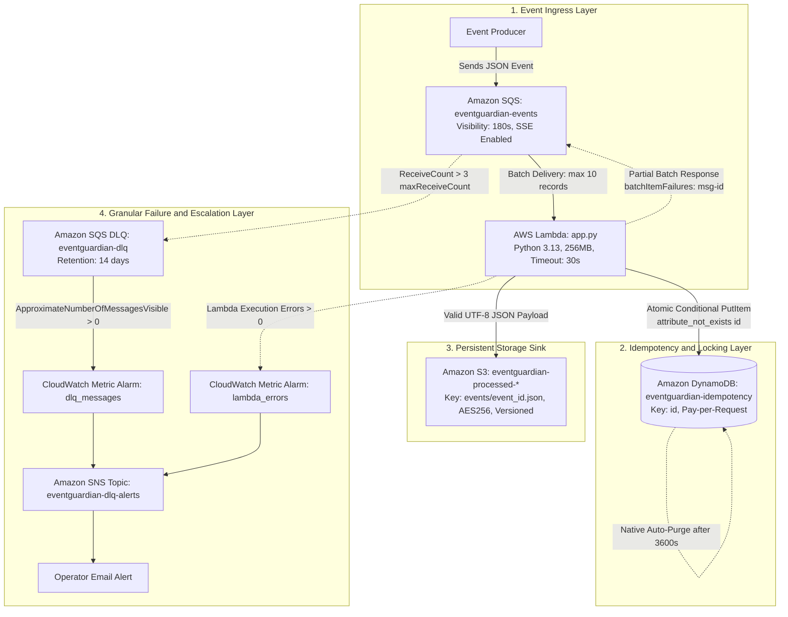

# ⚡ EventGuardian — Complete One-Day Technical Interview Preparation Guide & Architecture Reference

> **Project Mission:** A resilient, idempotent serverless stream-processing pipeline on AWS engineered to eliminate duplicate executions, isolate batch-level poison pills, and automatically bound state storage costs using Infrastructure as Code (Terraform).

---

## 📑 Table of Contents
1. [Project Overview & Core Problem](#1-project-overview--core-problem)
2. [Complete Architecture & Data Flow](#2-complete-architecture--data-flow)
3. [Repository File Inventory & Anatomy](#3-repository-file-inventory--anatomy)
4. [AWS Services Deep Dive](#4-aws-services-deep-dive)
5. [Concepts I Must Understand (35 Core Concepts)](#5-concepts-i-must-understand)
6. [Code Walkthrough: Line-by-Line Anatomy of app.py](#6-code-walkthrough-line-by-line-anatomy-of-apppy)
7. [Deep Dive: Idempotency & Concurrency](#7-deep-dive-idempotency--concurrency)
8. [Deep Dive: SQS & Lambda Batch Processing](#8-deep-dive-sqs--lambda-batch-processing)
9. [The Poison-Pill & Dead-Letter Queue (DLQ) Scenario](#9-the-poison-pill--dead-letter-queue-dlq-scenario)
10. [Terraform & Infrastructure as Code Architecture](#10-terraform--infrastructure-as-code-architecture)
11. [IAM Security & Principle of Least Privilege](#11-iam-security--principle-of-least-privilege)
12. [Testing Architecture & Automated Offline Test Suite](#12-testing-architecture--automated-offline-test-suite)
13. [Packaging & Cross-Platform Build Automation](#13-packaging--cross-platform-build-automation)
14. [Troubleshooting Guide (12 Real-World Scenarios)](#14-troubleshooting-guide)
15. ["What Happens If..." (20 Critical Scenarios)](#15-what-happens-if-20-critical-scenarios)
16. [Master Technical Interview Question Bank (140 Questions)](#16-master-technical-interview-question-bank)
17. [Rapid Fire (30 Questions & Punchy Answers)](#17-rapid-fire-30-questions--punchy-answers)
18. ["Why This Instead of That?" (Architectural Trade-Offs)](#18-why-this-instead-of-that)
19. [Interview Pitch Scripts (30s, 1m, 2m, 5m)](#19-interview-pitch-scripts)
20. [What I Can Safely Claim vs. Claims I Should NOT Make](#20-what-i-can-safely-claim-vs-claims-i-should-not-make)
21. [One-Day EventGuardian Preparation Plan (Phases 1–12)](#21-one-day-eventguardian-preparation-plan)
22. [Final 5-Minute Revision Cheat Sheet](#22-final-5-minute-revision-cheat-sheet)

---

## 1. Project Overview & Core Problem

### What EventGuardian Does
EventGuardian ingests asynchronous event payloads from **Amazon SQS Standard**, executes validation and business logic inside an **AWS Lambda** function, writes validated records as UTF-8 encoded JSON objects into **Amazon S3**, records transaction states in an **Amazon DynamoDB** table with an automated 1-hour Time-to-Live (TTL), isolates poison pills using SQS partial batch responses (`ReportBatchItemFailures`), and quarantines persistent failures into an **SQS Dead-Letter Queue (DLQ)** monitored by **CloudWatch** metric alarms and **SNS** email notifications.

### The Real Problem It Solves
In modern distributed cloud architectures, asynchronous stream processing systems rely on message brokers like Amazon SQS Standard. SQS Standard operates under **at-least-once delivery** semantics. While this guarantees high availability and massive horizontal scalability, it creates three fundamental distributed systems problems:

1. **Duplicate Message Delivery:** SQS Standard guarantees messages will be delivered *at least once*, but network timeouts, producer retries, and visibility timeout expirations cause messages to be delivered multiple times. Without an application-level idempotency layer, duplicate deliveries lead to duplicate database writes, repeated financial transactions, or redundant downstream API calls.
2. **Batch Head-of-Line Blocking from Poison Pills:** By default, AWS Lambda consumes SQS messages in batches (configured to `batch_size = 10` in EventGuardian). If a single message in that batch is malformed or causes an unhandled exception (a "poison pill"), the entire Lambda invocation fails. SQS marks the **entire batch of 10 messages** as unacknowledged. Sibling healthy messages that already completed side effects are redelivered and re-executed, causing retry amplification and blocking the queue.
3. **Runaway Deduplication State Costs:** To detect duplicates, systems store processed message IDs in a database. If IDs are stored permanently, the database grows indefinitely, incurring compounding storage costs and degrading lookup performance for records that will never be queried again.

---

## 2. Complete Architecture & Data Flow

### Architecture Diagram



### Complete End-to-End Data Flow

1. **Ingress:** An upstream service publishes an event to `eventguardian-events`.
2. **Polling & Batching:** The AWS Lambda event source mapping polls SQS and pulls a batch of up to 10 records.
3. **Context Registration:** `lambda_handler` invokes `idempotency_config.register_lambda_context(context)` to track execution time remaining and prevent processing timeouts.
4. **Key Extraction:** For each record in the batch, `record_handler` extracts the composite idempotency key based on `[tenant_id, client_request_id]`.
5. **State Check & Concurrency Lock:** Powertools issues a conditional `PutItem` to DynamoDB:
   * **If new:** Writes `status = IN_PROGRESS` with an epoch expiration timestamp (`now + 3600`).
   * **If completed (duplicate):** DynamoDB returns the existing item; Powertools checks payload hash integrity, short-circuits execution, and returns the cached result without touching S3.
   * **If concurrent duplicate:** Conditional check fails; Powertools raises `IdempotencyAlreadyInProgressError`, marking the record for retry in the next batch.
6. **Payload Processing & Storage:** If the lock succeeds, `process_event` validates required fields, verifies it is not a poison pill, serializes the event to UTF-8 bytes, and uploads it to S3 at `events/{event_id}.json`.
7. **State Finalization:** Powertools updates DynamoDB to `status = COMPLETED` and caches the function return value.
8. **Batch Acknowledgment:**
   * Successful records are acknowledged and deleted from SQS.
   * Any failing records have their `messageId` returned in `batchItemFailures`. SQS keeps only those failed records in the queue.
9. **DLQ Redrive & Alerting:** If an individual poison message fails 3 times (`maxReceiveCount = 3`), SQS routes it to `eventguardian-dlq`. The CloudWatch metric alarm triggers within 60 seconds and publishes an SNS notification to the engineer's email.

---

## 3. Repository File Inventory & Anatomy

| File / Folder | Technology | Concrete Responsibility |
| :--- | :--- | :--- |
| [`lambda_processor/app.py`](file:///d:/cloud_projects/eventguardian/lambda_processor/app.py) | Python 3.13 | Core Lambda handler; integrates Powertools `BatchProcessor`, `@idempotent_function`, schema validation, S3 storage, and structured logging. |
| [`lambda_processor/requirements.txt`](file:///d:/cloud_projects/eventguardian/lambda_processor/requirements.txt) | Pip | Defines production runtime dependencies: `aws-lambda-powertools==3.31.1` and `boto3==1.43.47`. |
| [`terraform/main.tf`](file:///d:/cloud_projects/eventguardian/terraform/main.tf) | HCL / Terraform | Specifies Terraform required version, AWS provider (`~> 6.0`), and target region (`ap-south-1`). |
| [`terraform/variables.tf`](file:///d:/cloud_projects/eventguardian/terraform/variables.tf) | HCL / Terraform | Declares input variables, specifically `budget_alert_email` marked as sensitive. |
| [`terraform/terraform.tfvars`](file:///d:/cloud_projects/eventguardian/terraform/terraform.tfvars) | HCL / Terraform | Assigns local values to input variables (e.g., target alert email address). |
| [`terraform/outputs.tf`](file:///d:/cloud_projects/eventguardian/terraform/outputs.tf) | HCL / Terraform | Exposes resource endpoints: `event_queue_url`, `dlq_url`, and `processed_bucket`. |
| [`terraform/sqs.tf`](file:///d:/cloud_projects/eventguardian/terraform/sqs.tf) | HCL / Terraform | Provisions main SQS queue (`visibility_timeout = 180s`) and DLQ (`retention = 14 days`) with redrive policy (`maxReceiveCount = 3`). |
| [`terraform/lambda.tf`](file:///d:/cloud_projects/eventguardian/terraform/lambda.tf) | HCL / Terraform | Configures Lambda function (Python 3.13, 256MB, 30s timeout), CloudWatch log group (7-day retention), and SQS Event Source Mapping with `ReportBatchItemFailures`. |
| [`terraform/dynamodb.tf`](file:///d:/cloud_projects/eventguardian/terraform/dynamodb.tf) | HCL / Terraform | Defines `eventguardian-idempotency` table (On-Demand billing, partition key `id`, TTL enabled on `expiration`). |
| [`terraform/s3.tf`](file:///d:/cloud_projects/eventguardian/terraform/s3.tf) | HCL / Terraform | Configures S3 processed bucket with public access block, AES256 server-side encryption, bucket versioning, and 90-day expiration lifecycle rule. |
| [`terraform/iam.tf`](file:///d:/cloud_projects/eventguardian/terraform/iam.tf) | HCL / Terraform | Defines Lambda execution role and strictly scoped least-privilege policy for SQS, DynamoDB, S3, and CloudWatch Logs. |
| [`terraform/cloudwatch.tf`](file:///d:/cloud_projects/eventguardian/terraform/cloudwatch.tf) | HCL / Terraform | Provisions metric alarms for DLQ message arrival (`Maximum ApproximateNumberOfMessagesVisible > 0`) and Lambda runtime `Errors > 0`. |
| [`terraform/sns.tf`](file:///d:/cloud_projects/eventguardian/terraform/sns.tf) | HCL / Terraform | Provisions `eventguardian-dlq-alerts` SNS topic and email subscription for alarm notifications. |
| [`terraform/budget.tf`](file:///d:/cloud_projects/eventguardian/terraform/budget.tf) | HCL / Terraform | Sets up an AWS Budget guardrail ($5 monthly limit, alert threshold at 80% / $4 actual spend). |
| [`build_lambda.py`](file:///d:/cloud_projects/eventguardian/build_lambda.py) | Python 3 | Cross-platform build script; cleans artifacts, installs dependencies into `build/`, copies `app.py`, and produces `lambda_function.zip`. |
| [`build_lambda.sh`](file:///d:/cloud_projects/eventguardian/build_lambda.sh) | Bash | Linux/macOS shell script for building the Lambda deployment package. |
| [`tests/test_pipeline.py`](file:///d:/cloud_projects/eventguardian/tests/test_pipeline.py) | Python / pytest | 8 automated offline unit and integration tests using `moto` covering all failure modes, concurrency, idempotency, and batch processing. |
| [`tests/run_test.py`](file:///d:/cloud_projects/eventguardian/tests/run_test.py) | Python 3 | Live integration test sender; dynamically extracts region from `EVENTGUARDIAN_QUEUE_URL` and supports individual or list payloads. |
| [`tests/events.json`](file:///d:/cloud_projects/eventguardian/tests/events.json) | JSON | Sample multi-event test payloads containing valid, duplicate, conflict, malformed, and poison events. |
| [`tests/`](file:///d:/cloud_projects/eventguardian/tests) subfolders | JSON | Granular event fixtures: `valid/`, `duplicate/`, `conflict/`, `malformed/`, `poison/`. |

---

## 4. AWS Services Deep Dive

### 1. Amazon SQS Standard
* **What it is:** A fully managed, highly available distributed message queuing service.
* **Why EventGuardian needs it:** Decouples event producers from Lambda consumers, buffers burst traffic, and provides controlled concurrency.
* **What happens if removed:** Producers would have to call Lambda synchronously. A spike in traffic would overwhelm downstream resources, and network drops would cause immediate data loss.
* **Why chosen over alternatives:** Standard SQS was chosen over SQS FIFO because Standard SQS provides virtually unlimited throughput and eliminates message group head-of-line blocking.
* **Exact Configuration:** Queue name `eventguardian-events`, `visibility_timeout_seconds = 180`, `sqs_managed_sse_enabled = true`.

### 2. AWS Lambda
* **What it is:** An event-driven serverless compute service executing code in isolated micro-VMs (Firecracker).
* **Why EventGuardian needs it:** Executes business logic and batch processing on demand, scaling automatically to zero when the queue is empty.
* **What happens if removed:** You would need dedicated virtual machines (EC2) or container clusters (ECS/EKS) running continuous polling loops, increasing cost and operational overhead.
* **Why chosen over alternatives:** Chosen over ECS/Fargate for instant auto-scaling, native SQS event source mapping, and zero baseline idle cost.
* **Exact Configuration:** Runtime `python3.13`, handler `app.lambda_handler`, memory `256MB`, timeout `30s`, log retention `7 days`.

### 3. Amazon DynamoDB
* **What it is:** A fully managed NoSQL key-value database delivering consistent single-digit millisecond latency.
* **Why EventGuardian needs it:** Provides an atomic locking mechanism (`attribute_not_exists`) for concurrent execution control and state tracking.
* **What happens if removed:** EventGuardian would have no centralized, strongly consistent state store to detect duplicates or coordinate concurrent executions.
* **Why chosen over alternatives:** Chosen over Redis/ElastiCache because DynamoDB requires no VPC peering, incurs zero idle cost on On-Demand billing, and includes native automated TTL.
* **Exact Configuration:** Table name `eventguardian-idempotency`, billing `PAY_PER_REQUEST`, partition key `id` (String), TTL enabled on `expiration`.

### 4. Amazon S3
* **What it is:** Highly durable, object-based cloud storage designed for 99.999999999% (11 9's) data durability.
* **Why EventGuardian needs it:** Acts as the persistent event archive / data lake sink for processed JSON events.
* **What happens if removed:** Processed events would have nowhere to be persistently stored.
* **Why chosen over alternatives:** Chosen over relational databases (RDS) because events are immutable documents. Storing raw JSON files in S3 is vastly cheaper and avoids database connection limits under high Lambda concurrency.
* **Exact Configuration:** Prefix `eventguardian-processed-`, all 4 public access blocks enabled, SSE AES256, versioning enabled, 90-day lifecycle expiration.

### 5. Amazon SQS Dead-Letter Queue (DLQ)
* **What it is:** A secondary SQS queue dedicated to holding messages that have repeatedly failed processing.
* **Why EventGuardian needs it:** Isolates poison pills after 3 attempts so they do not block healthy traffic or exhaust Lambda compute cycles.
* **What happens if removed:** Malformed messages would either retry indefinitely or be dropped silently after queue retention expires.
* **Why chosen over alternatives:** Standard native AWS queue redrive pattern; requires zero custom code.
* **Exact Configuration:** Name `eventguardian-dlq`, `message_retention_seconds = 1209600` (14 days), SSE enabled, attached via redrive policy with `maxReceiveCount = 3`.

### 6. Amazon CloudWatch
* **What it is:** A monitoring and observability service collecting metrics, logs, and alarms.
* **Why EventGuardian needs it:** Continuously monitors DLQ message depth and Lambda errors, triggering automated alerts when anomalies occur.
* **What happens if removed:** Operators would have no automated awareness of pipeline failures or poison pills.
* **Exact Configuration:** Two metric alarms:
  1. `dlq_messages`: Metric `ApproximateNumberOfMessagesVisible`, Namespace `AWS/SQS`, Statistic `Maximum`, Period `60s`, Threshold `0`, Operator `GreaterThanThreshold`.
  2. `lambda_errors`: Metric `Errors`, Namespace `AWS/Lambda`, Statistic `Sum`, Period `60s`, Threshold `0`, Operator `GreaterThanThreshold`.

### 7. Amazon SNS
* **What it is:** A fully managed pub/sub messaging service for fan-out and notification delivery.
* **Why EventGuardian needs it:** Dispatches immediate email notifications to engineering teams when CloudWatch alarms trip.
* **What happens if removed:** CloudWatch alarms would trigger with no downstream notification mechanism.
* **Exact Configuration:** Topic `eventguardian-dlq-alerts`, email subscription pointing to `var.budget_alert_email`.

### 8. AWS Identity and Access Management (IAM)
* **What it is:** Identity and access governance service enforcing least-privilege permissions across AWS resources.
* **Why EventGuardian needs it:** Ensures the Lambda execution role has strictly bounded permissions and cannot touch unauthorized AWS services.
* **Exact Configuration:** Role `eventguardian-lambda-role` assuming `lambda.amazonaws.com`; policy strictly scoped to SQS queue ARN, DynamoDB table ARN, S3 bucket ARN + `/events/*` prefix, and CloudWatch log group ARN + `:*`.

### 9. HashiCorp Terraform
* **What it is:** Declarative Infrastructure as Code (IaC) tool for provisioning and versioning cloud resources.
* **Why EventGuardian needs it:** Guarantees 100% reproducible, automated, and version-controlled infrastructure deployments.
* **Exact Configuration:** Terraform `1.14+`, AWS Provider `~> 6.0`, region `ap-south-1`.

### 10. AWS Lambda Powertools for Python
* **What it is:** An AWS-maintained suite of utilities for serverless architectures implementing best practices.
* **Why EventGuardian needs it:** Implements production-grade idempotency decorators (`@idempotent_function`), structured JSON logging (`Logger`), and partial batch failure parsing (`BatchProcessor`).
* **What happens if removed:** You would have to write ~250 lines of complex, custom DynamoDB conditional locking, TTL calculation, exception catching, and batch JSON formatting code.

---

## 5. Concepts I Must Understand

### 1. Asynchronous Processing
* **Definition:** A system architecture where the caller does not wait for a task to complete before continuing execution.
* **Why it exists:** Prevents client blocking, increases throughput, and decouples services.
* **How EventGuardian uses it:** Producers send messages to SQS and immediately receive an acknowledgment without waiting for Lambda or S3 processing.
* **Small Example:** Placing an order on Amazon: you get an order confirmation immediately while backend inventory and shipping process in the background.
* **Interview Question:** *How does asynchronous processing improve system resilience compared to synchronous HTTP APIs?*

### 2. Message Queues
* **Definition:** A buffer data structure that stores messages in transit between distributed components.
* **Why it exists:** Absorbs traffic spikes, smooths out bursts, and isolates producer and consumer lifecycles.
* **How EventGuardian uses it:** SQS acts as the buffer between upstream event sources and Lambda workers.
* **Small Example:** A queue at a bank teller: customers arrive at variable speeds, but the teller processes them one by one at a steady pace.
* **Interview Question:** *What happens when a message queue consumer crashes while processing a message?*

### 3. SQS Standard
* **Definition:** The default SQS queue type providing maximum throughput, best-effort ordering, and at-least-once delivery.
* **Why it exists:** Built for massive, horizontally distributed scalability where strict sequencing is not required.
* **How EventGuardian uses it:** Serves as the primary ingestion queue (`eventguardian-events`).
* **Small Example:** Ingesting website analytics clickstream data where speed is critical and ordering does not matter.
* **Interview Question:** *What are the three main differences between SQS Standard and SQS FIFO?*

### 4. At-Least-Once Delivery
* **Definition:** A distributed messaging guarantee that a message is guaranteed to be delivered one or more times.
* **Why it exists:** In distributed systems, network partitions prevent achieving both 100% delivery guarantee and exactly-once delivery without extreme throughput penalties.
* **How EventGuardian uses it:** EventGuardian assumes SQS *will* deliver duplicates and handles them in the application layer.
* **Small Example:** A mail carrier delivering letters: if they are unsure you got the letter because of a dog in the yard, they drop another copy tomorrow.
* **Interview Question:** *Why can message brokers not guarantee exactly-once delivery across network boundaries?*

### 5. Duplicate Messages
* **Definition:** Identical message payloads arriving multiple times at the consumer.
* **Why it exists:** Caused by producer network retries, visibility timeout expiry, or dropped `DeleteMessage` calls.
* **How EventGuardian uses it:** Identifies duplicates via DynamoDB state lookups and bypasses downstream S3 writes.
* **Small Example:** Clicking "Submit Order" twice because the browser seemed to freeze for 2 seconds.
* **Interview Question:** *Under what three network conditions will SQS deliver a duplicate message?*

### 6. Idempotency
* **Definition:** The mathematical property where an operation can be applied multiple times without changing the result beyond the initial application ($f(f(x)) = f(x)$).
* **Why it exists:** Allows distributed systems to safely retry failed operations without risking duplicate side effects.
* **How EventGuardian uses it:** Calling `process_event()` with the same payload 10 times results in exactly one S3 object write.
* **Small Example:** Setting a volume slider to 50% is idempotent; pressing "Volume Up" is not idempotent.
* **Interview Question:** *Is HTTP POST naturally idempotent? How do you make it idempotent?*

### 7. Idempotent Consumer Pattern
* **Definition:** An enterprise integration pattern where the message consumer checks a persistent store to verify if a message has already been processed before executing business logic.
* **Why it exists:** Decouples message delivery guarantees (at-least-once) from business processing guarantees (effectively-once).
* **How EventGuardian uses it:** Uses DynamoDB as the state store and `@idempotent_function` to wrap the event handler.
* **Small Example:** Checking a receipt book before refunding a customer's money.
* **Interview Question:** *How does the Idempotent Consumer pattern differ from database deduplication using unique constraints?*

### 8. Business Idempotency Keys
* **Definition:** An identifier derived from the domain business data rather than infrastructure message IDs.
* **Why it exists:** SQS assigns a brand new `MessageId` every time an event is retried, making message broker IDs useless for deduplication.
* **How EventGuardian uses it:** Extracts `client_request_id` from the JSON payload.
* **Small Example:** Using an invoice number (`INV-2026-001`) instead of the email's SMTP message ID.
* **Interview Question:** *Why should you never use SQS MessageId as an idempotency key?*

### 9. Composite Keys
* **Definition:** An idempotency key formed by concatenating two or more attributes.
* **Why it exists:** Prevents collisions in multi-tenant systems where different customers might independently generate the same request ID.
* **How EventGuardian uses it:** Combines `[tenant_id, client_request_id]` via JMESPath.
* **Small Example:** A hotel room key: Room 101 in Building A is different from Room 101 in Building B.
* **Interview Question:** *What happens if you omit the tenant_id from the idempotency key in a SaaS platform?*

### 10. DynamoDB Conditional Writes
* **Definition:** A DynamoDB write operation that only succeeds if an attribute meets specified conditions (`attribute_not_exists`).
* **Why it exists:** Provides atomic, strongly consistent concurrency control without distributed locks.
* **How EventGuardian uses it:** Executes `PutItem` with `attribute_not_exists(id)` to acquire an execution lock.
* **Small Example:** Booking a movie seat: the database only lets you reserve Seat 4B if `booked == false`.
* **Interview Question:** *How do DynamoDB conditional writes prevent Time-of-Check to Time-of-Use (TOCTOU) race conditions?*

### 11. Race Conditions
* **Definition:** A concurrency flaw where the output of a system depends on the non-deterministic timing of uncontrollable events.
* **Why it exists:** Occurs when multiple threads or processes read and write shared data concurrently.
* **How EventGuardian uses it:** Eliminates race conditions by relying on DynamoDB's Paxos consensus rather than a separate read-then-write sequence.
* **Small Example:** Two people using the same bank account withdrawing \$100 at the exact same second when only \$100 is in the account.
* **Interview Question:** *Why is `if not get_item(): put_item()` vulnerable to race conditions?*

### 12. Concurrent Lambda Executions
* **Definition:** Multiple Lambda instances running simultaneously in independent Firecracker micro-VMs to process different messages.
* **Why it exists:** Allows serverless architectures to scale horizontally to match queue depth.
* **How EventGuardian uses it:** Multiple workers pull batches concurrently; DynamoDB coordinates idempotency state across all workers.
* **Small Example:** 10 cashiers opening up at a supermarket when 100 shoppers arrive at once.
* **Interview Question:** *How do stateless Lambda workers synchronize state during high-concurrency bursts?*

### 13. IN_PROGRESS vs. COMPLETED
* **Definition:** Two distinct states tracked in the idempotency table: `IN_PROGRESS` (currently executing) and `COMPLETED` (finished and cached).
* **Why it exists:** Distinguishes between an active execution and a finished operation, preventing duplicate concurrent runs.
* **How EventGuardian uses it:** Sets `status = IN_PROGRESS` before calling `process_event()`, updating to `COMPLETED` upon return.
* **Small Example:** A restroom door lock: "Occupied" (in progress) vs. "Vacant" vs. "Cleaned and inspected" (completed).
* **Interview Question:** *What happens if a Lambda instance dies while a record is IN_PROGRESS?*

### 14. Time-to-Live (TTL)
* **Definition:** A database feature that automatically deletes expired records after a specified timestamp.
* **Why it exists:** Automatically purges transient data without consuming write capacity units or requiring background cron jobs.
* **How EventGuardian uses it:** Automatically purges idempotency records after 1 hour (3,600s) on the `expiration` attribute.
* **Small Example:** A parking ticket that expires automatically after 2 hours.
* **Interview Question:** *How does DynamoDB TTL delete records, and does it cost Write Capacity Units (WCUs)?*

### 15. Lambda Event Source Mapping
* **Definition:** An AWS-managed poller that reads messages from an event source (like SQS) and invokes a Lambda function synchronously.
* **Why it exists:** Eliminates the need for developers to write custom queue polling loops and connection managers.
* **How EventGuardian uses it:** Configured in `lambda.tf` to pull batches of 10 records from `aws_sqs_queue.events.arn`.
* **Small Example:** A conveyor belt that delivers 10 packages at a time to a worker's desk.
* **Interview Question:** *Where does the Event Source Mapping poller run: inside Lambda or as an AWS-managed service?*

### 16. Batch Processing
* **Definition:** Grouping multiple records into a single compute invocation.
* **Why it exists:** Drastically reduces Lambda invocation costs and API overhead compared to processing 1 record per invocation.
* **How EventGuardian uses it:** Uses `batch_size = 10` in `aws_lambda_event_source_mapping.sqs_trigger`.
* **Small Example:** Carrying 10 grocery bags into the house in one trip instead of making 10 individual trips.
* **Interview Question:** *What is the cost impact of changing batch_size from 10 to 1 on an SQS Lambda trigger?*

### 17. Partial Batch Failure
* **Definition:** An error-handling mechanism where individual failing items in a batch are reported back to the broker, while successful items commit.
* **Why it exists:** Prevents a single corrupt message from failing healthy sibling messages in the same batch.
* **How EventGuardian uses it:** Implements Powertools `BatchProcessor` to isolate poison pills.
* **Small Example:** If 1 egg in a carton of 12 is cracked, you replace the 1 egg rather than throwing away all 12 eggs.
* **Interview Question:** *What was the default behavior of SQS + Lambda before partial batch failure reporting was introduced?*

### 18. ReportBatchItemFailures
* **Definition:** The specific AWS configuration setting that enables partial batch response reporting.
* **Why it exists:** Informs AWS Lambda that the function will return a JSON object listing failed `messageId`s.
* **How EventGuardian uses it:** Configured in `lambda.tf` as `function_response_types = ["ReportBatchItemFailures"]`.
* **Small Example:** A shipping inspector checking a box of 10 items and stamping: "Approved: 1-9; Rejected: 10".
* **Interview Question:** *What exact JSON structure must a Lambda function return when ReportBatchItemFailures is enabled?*

### 19. Poison Messages (Poison Pills)
* **Definition:** A message that consistently crashes consumer execution logic due to malformed syntax, missing fields, or software bugs.
* **Why it exists:** Arises from schema evolution mismatches, serialization bugs, or malicious inputs.
* **How EventGuardian uses it:** Catches poison pills (`POISON_EVENT` and validation errors) and isolates them via partial batch responses.
* **Small Example:** A vending machine jammed by a slug or foreign coin that cannot be processed.
* **Interview Question:** *What is head-of-line blocking in an SQS queue caused by a poison pill?*

### 20. Message Retries
* **Definition:** The automated redelivery of a message after processing fails or visibility expires.
* **Why it exists:** Recovers from transient network glitches, database throttling, or temporary third-party outages.
* **How EventGuardian uses it:** Allows failed messages to be retried up to 3 times before DLQ routing.
* **Small Example:** Redialing a phone number automatically when you hear a busy signal.
* **Interview Question:** *Why can unlimited retries lead to a cascading failure across downstream services?*

### 21. SQS Visibility Timeout
* **Definition:** The period of time during which SQS hides a message from other consumers after a worker receives it.
* **Why it exists:** Prevents multiple workers from processing the exact same message concurrently under normal conditions.
* **How EventGuardian uses it:** Configured to `180s` in `sqs.tf`, which is exactly $6 	imes$ the Lambda timeout (`30s`).
* **Small Example:** A library book being marked "Checked Out" for 3 weeks so no one else takes it off the shelf.
* **Interview Question:** *What happens if the SQS visibility timeout is shorter than the Lambda function timeout?*

### 22. Receive Count (ApproximateReceiveCount)
* **Definition:** An SQS system attribute tracking how many times a message has been delivered to a consumer.
* **Why it exists:** Enables redrive policies to detect when a message has failed repeatedly.
* **How EventGuardian uses it:** Compares receive count against `maxReceiveCount = 3` to trigger DLQ diversion.
* **Small Example:** A strike system: 3 strikes and you are out.
* **Interview Question:** *Why is ApproximateReceiveCount approximate rather than strictly exact?*

### 23. Dead-Letter Queue (DLQ)
* **Definition:** An isolated queue holding messages that failed processing more than `maxReceiveCount` times.
* **Why it exists:** Preserves failed messages for offline forensic inspection and unblocks the main processing pipeline.
* **How EventGuardian uses it:** `eventguardian-dlq` stores poison pills for up to 14 days.
* **Small Example:** An undeliverable mail bin at the post office where damaged envelopes are sent for manual address lookup.
* **Interview Question:** *How do you reprocess messages stored in an SQS DLQ after fixing the consumer bug?*

### 24. S3 Object Keys
* **Definition:** The unique identifier / path for an object stored within an Amazon S3 bucket.
* **Why it exists:** S3 is a flat key-value store; object keys simulate hierarchical directory structures.
* **How EventGuardian uses it:** Stores events at `events/{event_id}.json`.
* **Small Example:** `photos/2026/vacation.jpg`.
* **Interview Question:** *How does deterministic object key naming support idempotent storage in S3?*

### 25. S3 Bucket Versioning
* **Definition:** A feature that preserves multiple versions of an object in the same bucket.
* **Why it exists:** Protects against unintended overwrites, malicious deletions, and enables audit trails.
* **How EventGuardian uses it:** Enabled on `eventguardian-processed-*` bucket in `s3.tf`.
* **Small Example:** Google Docs version history: you can restore any previous revision of your document.
* **Interview Question:** *What happens when you delete an object in a versioned S3 bucket without specifying a version ID?*

### 26. Server-Side Encryption (SSE)
* **Definition:** Encryption of data at rest where AWS handles encryption before storage and decryption upon retrieval.
* **Why it exists:** Satisfies compliance standards (SOC2, HIPAA, PCI-DSS) and protects data against physical disk compromise.
* **How EventGuardian uses it:** Enforces AES256 server-side encryption across SQS and S3.
* **Small Example:** Storing valuables in a locked hotel room safe.
* **Interview Question:** *What is the difference between SSE-S3 (AES256) and SSE-KMS?*

### 27. CloudWatch Metrics
* **Definition:** Time-series data points emitted by AWS services (e.g., invocations, errors, queue depth).
* **Why it exists:** Provides quantitative visibility into system health, performance, and resource saturation.
* **How EventGuardian uses it:** Tracks `ApproximateNumberOfMessagesVisible` on DLQ and `Errors` on Lambda.
* **Small Example:** A car's speedometer and fuel gauge.
* **Interview Question:** *What is the metric resolution of standard CloudWatch metrics vs. high-resolution metrics?*

### 28. CloudWatch Alarms
* **Definition:** An automated watcher that monitors a metric and triggers actions when the metric crosses a threshold.
* **Why it exists:** Automates incident detection and alerting without requiring human dashboard watching.
* **How EventGuardian uses it:** Trips if DLQ messages $> 0$ or Lambda errors $> 0$.
* **Small Example:** A smoke detector alarm triggering when smoke particles exceed a safe threshold.
* **Interview Question:** *What are the three operational states of a CloudWatch alarm?*

### 29. SNS Notifications
* **Definition:** Push-based message delivery to subscribers (email, SMS, HTTP endpoints, Lambda).
* **Why it exists:** Enables instant multi-channel alerting when system events or alarms fire.
* **How EventGuardian uses it:** Sends email alerts to operators when the DLQ alarm trips.
* **Small Example:** An amber alert broadcast to all cell phones in a geographic area.
* **Interview Question:** *Why does an SNS email subscription remain in PendingConfirmation until verified?*

### 30. IAM Least Privilege
* **Definition:** The security principle that an identity should only be granted the absolute minimum permissions required to perform its task.
* **Why it exists:** Minimizes the blast radius if credentials or compute instances are compromised.
* **How EventGuardian uses it:** Scopes Lambda permissions down to exact table, queue, bucket, and log group ARNs.
* **Small Example:** Giving a hotel guest a keycard that opens only their room and the gym, not the manager's office.
* **Interview Question:** *Why should you never use `Resource: "*"` in a production Lambda IAM policy?*

### 31. Infrastructure as Code (IaC)
* **Definition:** Managing and provisioning cloud infrastructure through version-controlled definition files rather than manual console configuration.
* **Why it exists:** Guarantees consistency, eliminates human error, and enables automated CI/CD deployments.
* **How EventGuardian uses it:** 100% of resources are defined in Terraform.
* **Small Example:** A cooking recipe: following the exact instructions produces the identical dish every time.
* **Interview Question:** *What are the risks of "ClickOps" (manual console changes) in enterprise cloud environments?*

### 32. Terraform State
* **Definition:** A file (`terraform.tfstate`) that maps real-world cloud resources to the declarative Terraform configuration.
* **Why it exists:** Allows Terraform to detect drift, track metadata, and calculate necessary updates during `terraform plan`.
* **How EventGuardian uses it:** Maintained in the `terraform/` directory.
* **Small Example:** A building blueprint ledger that records which beams have already been installed on site.
* **Interview Question:** *Why should Terraform state be stored in a remote backend (like S3) with state locking (DynamoDB)?*

### 33. Unit Testing vs. Integration Testing
* **Definition:** Unit testing evaluates individual functions in isolation; integration testing evaluates multiple components working together.
* **Why it exists:** Catches syntax errors, logic flaws, and integration regressions early in the development lifecycle.
* **How EventGuardian uses it:** Uses `pytest` with `moto` to test the full Lambda handler and Powertools pipeline offline.
* **Small Example:** Testing individual spark plugs on a bench (unit test) vs. starting the assembled car engine (integration test).
* **Interview Question:** *Why are mocked offline integration tests preferred in fast CI/CD pipelines over real cloud deployments?*

### 34. Moto (Mocking AWS)
* **Definition:** An open-source Python testing library that simulates AWS services in-memory without hitting real AWS APIs.
* **Why it exists:** Enables fast, cost-free, offline testing of AWS SDK code.
* **How EventGuardian uses it:** Simulates DynamoDB tables, S3 buckets, and SQS records in `tests/test_pipeline.py`.
* **Small Example:** A flight flight-simulator used to train pilots safely without flying a real commercial jet.
* **Interview Question:** *What are the limitations of Moto compared to testing against real AWS endpoints?*

### 35. Lambda Deployment Packaging
* **Definition:** Compiling application code and third-party dependencies into a standalone `.zip` archive or container image.
* **Why it exists:** Lambda micro-VMs are stateless and contain only the standard Python runtime and Boto3; third-party packages must be bundled.
* **How EventGuardian uses it:** `build_lambda.py` packages `app.py` and `requirements.txt` into `lambda_function.zip`.
* **Small Example:** Packing a suitcase with all clothes and toiletries needed for an international trip.
* **Interview Question:** *Why does packaging Boto3 in a Lambda zip file increase package size unnecessarily?*

---

## 6. Code Walkthrough: Line-by-Line Anatomy of `app.py`

### Module-Level Initialization (`app.py:1–38`)

```python
import json
import os
import boto3
from aws_lambda_powertools import Logger
from aws_lambda_powertools.utilities.batch import (
    BatchProcessor,
    EventType,
    process_partial_response,
)
from aws_lambda_powertools.utilities.data_classes.sqs_event import SQSRecord
from aws_lambda_powertools.utilities.idempotency import (
    DynamoDBPersistenceLayer,
    IdempotencyConfig,
    idempotent_function,
)

logger = Logger(service="eventguardian")

TABLE_NAME = os.environ.get("IDEMPOTENCY_TABLE", "eventguardian-idempotency")
OUTPUT_BUCKET = os.environ.get("OUTPUT_BUCKET", "eventguardian-processed")

s3 = boto3.client("s3")
persistence_layer = DynamoDBPersistenceLayer(table_name=TABLE_NAME)

idempotency_config = IdempotencyConfig(
    event_key_jmespath="[tenant_id, client_request_id]",
    payload_validation_jmespath="[event_type, payload]",
    expires_after_seconds=3600,
    raise_on_no_idempotency_key=True,
)

processor = BatchProcessor(event_type=EventType.SQS)
```

#### Why it was written this way:
* **Global AWS Clients:** Initializing `boto3.client("s3")` and `DynamoDBPersistenceLayer` outside the handler enables **connection reuse** across Lambda warm starts, eliminating TCP handshake and TLS negotiation overhead on subsequent invocations.
* **Safe Fallbacks:** `os.environ.get()` with defaults allows the module to be imported during unit testing and static analysis without throwing `KeyError`.
* **JMESPath Idempotency Key:** `event_key_jmespath="[tenant_id, client_request_id]"` extracts only the business-level composite key.
* **Payload Validation:** `payload_validation_jmespath="[event_type, payload]"` hashes the payload to detect tampering if an existing key is reused.
* **Expiration:** `expires_after_seconds=3600` bounds DynamoDB state storage to 1 hour.
* **Strict Enforcement:** `raise_on_no_idempotency_key=True` immediately rejects payloads missing either `tenant_id` or `client_request_id`.

---

### Function 1: `process_event(event_data: dict)` (`app.py:40–112`)

```python
@idempotent_function(
    data_keyword_argument="event_data",
    persistence_store=persistence_layer,
    config=idempotency_config,
)
def process_event(event_data: dict):
    required_fields = [
        "event_id", "event_type", "tenant_id",
        "client_request_id", "timestamp", "payload",
    ]
    missing = [field for field in required_fields if field not in event_data]
    if missing:
        logger.error("Validation failed", extra={"missing_fields": missing, "event": event_data})
        raise ValueError(f"Missing fields: {missing}")

    if event_data["event_type"] == "POISON_EVENT":
        logger.error("Poison event detected", extra={"event_id": event_data["event_id"]})
        raise RuntimeError("Controlled poison event")

    event_id = event_data["event_id"]
    logger.info("Processing event", extra={"event_id": event_id, "event_type": event_data["event_type"]})

    s3.put_object(
        Bucket=OUTPUT_BUCKET,
        Key=f"events/{event_id}.json",
        Body=json.dumps(event_data).encode("utf-8"),
        ContentType="application/json",
    )

    return {
        "status": "COMPLETED",
        "event_id": event_id,
        "event_type": event_data["event_type"],
    }
```

* **Input:** `event_data` (Python `dict` representing a single event).
* **Processing:**
  1. Validates all 6 required fields.
  2. Detects controlled poison pill (`POISON_EVENT`).
  3. Serializes event to JSON and encodes to UTF-8 bytes.
* **AWS Interaction:**
  * DynamoDB: Managed automatically by `@idempotent_function` (conditional `PutItem` and `UpdateItem`).
  * S3: Executes `s3.put_object` to store the event at `events/{event_id}.json`.
* **Output:** Returns a dictionary: `{"status": "COMPLETED", "event_id": ..., "event_type": ...}`.
* **Failure Behavior:**
  * Missing fields: Raises `ValueError`.
  * Poison pill: Raises `RuntimeError`.
  * The decorator catches runtime exceptions, **deletes the in-progress DynamoDB record**, and propagates the error to the batch processor so SQS can retry.

---

### Function 2: `record_handler(record: SQSRecord)` (`app.py:115–117`)

```python
def record_handler(record: SQSRecord):
    event_data = json.loads(record.body)
    return process_event(event_data=event_data)
```

* **Input:** An individual `SQSRecord` object passed by `BatchProcessor`.
* **Processing:** Deserializes `record.body` string into a Python dictionary.
* **Output:** Forwards return dictionary from `process_event()`.
* **Failure Behavior:** If `record.body` contains invalid JSON, `json.loads` raises `json.JSONDecodeError`. `BatchProcessor` catches it and flags the record for failure.

---

### Function 3: `lambda_handler(event, context)` (`app.py:120–129`)

```python
@logger.inject_lambda_context(log_event=True)
def lambda_handler(event, context):
    idempotency_config.register_lambda_context(context)

    return process_partial_response(
        event=event,
        record_handler=record_handler,
        processor=processor,
        context=context,
    )
```

* **Input:** Standard AWS Lambda SQS event dictionary and `LambdaContext` object.
* **Processing:**
  1. Injects structured log metadata (request ID, function name, cold start status).
  2. Registers `context` with `idempotency_config` so Powertools knows function timeout limits.
  3. Invokes `process_partial_response()` which loops over records in the batch.
* **Output:** Returns partial batch response JSON: `{"batchItemFailures": [{"itemIdentifier": "failed-id"}]}`.
* **Failure Behavior:** Handled gracefully per record. The handler itself returns HTTP 200 to the Lambda poller with the list of failed message IDs.

---

## 7. Deep Dive: Idempotency & Concurrency

> **Accurate Architectural Guarantee:** EventGuardian provides **at-least-once delivery with effectively-once execution semantics within the configured 1-hour idempotency window**. It does NOT provide infinite or global exactly-once processing.

---

### Scenario A — First Request
1. Producer sends event: `{"tenant_id": "t1", "client_request_id": "r100", ...}`.
2. Lambda receives record; Powertools hashes `[t1, r100]`.
3. DynamoDB conditional `PutItem` executes:
   ```text
   ConditionExpression: attribute_not_exists(id) OR (in_progress_expiration < :now) OR (expiration < :now)
   ```
4. DynamoDB commits item: `status = IN_PROGRESS`.
5. Business logic runs; S3 `put_object` writes `events/{id}.json`.
6. Powertools updates DynamoDB: `status = COMPLETED`, caches response.
7. SQS deletes message.

---

### Scenario B — Exact Duplicate
1. SQS delivers identical message due to network retry.
2. Powertools evaluates hash of `[t1, r100]`.
3. DynamoDB `GetItem` finds existing record with `status = COMPLETED`.
4. Powertools evaluates `payload_validation_jmespath`. The hash matches.
5. **Execution short-circuits:** `process_event()` is **not executed**. No S3 call is made.
6. The cached response is returned immediately; SQS deletes the duplicate.

---

### Scenario C — Simultaneous Invocations (Race Condition)
1. Network blip causes SQS to deliver two identical messages to two concurrent Lambda instances simultaneously.
2. Both instances hash the key and issue conditional `PutItem` to DynamoDB at the exact same millisecond.
3. DynamoDB's Paxos consensus ensures **only one write succeeds**.
4. **Winner:** Gains `status = IN_PROGRESS` and executes business logic.
5. **Loser:** Receives `ConditionalCheckFailedException`. Powertools detects active `IN_PROGRESS` state and raises `IdempotencyAlreadyInProgressError`.
6. `BatchProcessor` catches the exception and returns the message ID in `batchItemFailures`.
7. SQS leaves the message in the queue. When the visibility timeout expires and SQS redelivers, the first instance has marked the record `COMPLETED`, so the retried message receives the cached result safely.

---

### Scenario D — Same Request ID, Mutated Payload
1. A client reuses `client_request_id = "r100"`, but changes the amount from \$100 to \$500.
2. Powertools finds the existing record in DynamoDB.
3. Powertools hashes `[event_type, payload]` and compares it to the stored `validation` attribute.
4. The hashes **do not match**.
5. Powertools raises `IdempotencyValidationError`. Execution is blocked, preventing payload tampering or replay corruption.

---

### Scenario E — Lambda Crashes Midway Through Execution
1. Lambda acquires `IN_PROGRESS` lock, but crashes (e.g. Out of Memory or host termination) before finishing.
2. The DynamoDB record remains in `status = IN_PROGRESS`.
3. After `in_progress_expiration` passes, SQS redelivers the message.
4. Powertools evaluates the record. Because `in_progress_expiration < :now`, Powertools treats the previous lock as abandoned, overwrites it with a fresh `IN_PROGRESS` lock, and re-executes cleanly.

---

### Scenario F — S3 Succeeds But DynamoDB Update Fails (The Dual-Write Problem)
1. `s3.put_object` writes successfully.
2. Lambda micro-VM terminates immediately before Powertools updates DynamoDB to `COMPLETED`.
3. SQS visibility expires and redelivers the message.
4. The next invocation sees an expired in-progress lock and re-executes `process_event()`.
5. `s3.put_object` runs a second time.
6. **Why this is safe in EventGuardian:** Writing identical bytes to the exact same key (`events/{event_id}.json`) in S3 is an **idempotent overwrite**. Data consistency is maintained. (However, if the downstream action was an external non-idempotent credit card charge, a duplicate charge would occur).

---

### Scenario G — Idempotency TTL Expires After 1 Hour
1. An event processes successfully at 10:00 AM (`expiration = 11:00 AM`).
2. At 11:01 AM, DynamoDB's native TTL process sweeps and deletes the item.
3. At 11:05 AM, an upstream service retries the identical event.
4. Because the DynamoDB record no longer exists, EventGuardian treats it as a brand-new event and re-executes it.

---

## 8. Deep Dive: SQS and Lambda Batch Processing

### Batch Configuration Parameters
* **Batch Size:** `10` records per Lambda invocation.
* **Lambda Timeout:** `30` seconds.
* **SQS Visibility Timeout:** `180` seconds.

### The $6	imes$ Timeout Rule
AWS recommends:
$$	ext{Queue Visibility Timeout} \ge 6 	imes 	ext{Lambda Function Timeout} + 	ext{Batch Window}$$
In EventGuardian:
$$180s = 6 	imes 30s + 0s$$
This guarantees that if Lambda takes its full 30-second execution allowance, SQS will not prematurely release messages to other workers, preventing accidental duplicate invocations.

---

### Batch Walkthrough: Records `[A, B, C, D, E]` where `C` Fails

```text
[ A, B, C, D, E ] delivered in 1 batch
       │
       ├── A: Processed -> S3 Write OK
       ├── B: Processed -> S3 Write OK
       ├── C: Corrupt Payload -> Raises ValueError
       │      └── BatchProcessor catches error, records msg-C in failures
       ├── D: Processed -> S3 Write OK
       └── E: Processed -> S3 Write OK
       │
Lambda returns: { "batchItemFailures": [ { "itemIdentifier": "msg-C" } ] }
       │
SQS Action:
  - Deletes A, B, D, E permanently
  - Keeps C in queue (ApproximateReceiveCount becomes 1)
```

#### What happens across repeated retries:
1. **Attempt 1:** `C` fails. SQS receives failure for `msg-C`. Receive count = 1.
2. **Attempt 2:** SQS redelivers `C` after visibility timeout. `C` fails again. Receive count = 2.
3. **Attempt 3:** SQS redelivers `C`. `C` fails again. Receive count = 3.
4. **Attempt 4:** SQS detects `ReceiveCount > maxReceiveCount (3)`. SQS automatically redrives message `C` to `eventguardian-dlq` and removes it from `eventguardian-events`.
5. Healthy messages `A, B, D, E` were **never retried or blocked**.

---

## 9. The Poison-Pill & Dead-Letter Queue (DLQ) Scenario

### Failure Escalation Flow

```text
Message Ingress (Corrupted / Poison Payload)
         │
         ▼
[ Attempt 1 ] ──► Lambda crashes ──► Reported in batchItemFailures (ReceiveCount = 1)
         │
         ▼ (Wait visibility timeout: 180s)
[ Attempt 2 ] ──► Lambda crashes ──► Reported in batchItemFailures (ReceiveCount = 2)
         │
         ▼ (Wait visibility timeout: 180s)
[ Attempt 3 ] ──► Lambda crashes ──► Reported in batchItemFailures (ReceiveCount = 3)
         │
         ▼ (maxReceiveCount = 3 exceeded)
[ Divert to DLQ: eventguardian-dlq ] ──► Message stored safely for 14 days
         │
         ▼
[ CloudWatch Alarm: dlq_messages ] ──► Trips within 60 seconds (Maximum > 0)
         │
         ▼
[ Amazon SNS Topic: eventguardian-dlq-alerts ] ──► Dispatches Email to Engineers
```

### Why this is superior to continuous retries:
* **Prevents Head-of-Line Blocking:** In FIFO queues or un-isolated batch systems, a poison pill halts all processing behind it.
* **Eliminates Compute Waste:** Continuously retrying a permanent error consumes Lambda execution time, memory, and database connections indefinitely.
* **Preserves Forensic Evidence:** The corrupted payload is preserved in the DLQ for 14 days, allowing developers to inspect headers, payload schema, and write bug fixes.

---

## 10. Terraform & Infrastructure as Code Architecture

### Core Terraform Commands
* `terraform init`: Downloads provider plugins (AWS `~> 6.0`) and initializes the `.terraform` backend.
* `terraform fmt`: Formats HCL syntax to HashiCorp standard indentation.
* `terraform validate`: Verifies configuration syntax and internal resource reference integrity without connecting to cloud APIs.
* `terraform plan`: Reads current cloud state, compares it to declarative `.tf` files, and generates a speculative execution plan.
* `terraform apply`: Provisions or updates real-world cloud resources to match state.
* `terraform destroy`: Tears down all resources managed by the state file.

### Terraform Resources in EventGuardian
* **SQS:** `aws_sqs_queue.events`, `aws_sqs_queue.dlq`.
* **Lambda:** `aws_lambda_function.processor`, `aws_cloudwatch_log_group.lambda_logs`, `aws_lambda_event_source_mapping.sqs_trigger`.
* **DynamoDB:** `aws_dynamodb_table.idempotency`.
* **S3:** `aws_s3_bucket.processed`, `aws_s3_bucket_public_access_block.processed`, `aws_s3_bucket_server_side_encryption_configuration.processed`, `aws_s3_bucket_versioning.processed`, `aws_s3_bucket_lifecycle_configuration.processed`.
* **IAM:** `aws_iam_role.lambda_role`, `aws_iam_role_policy.lambda_policy`.
* **Monitoring:** `aws_cloudwatch_metric_alarm.dlq_messages`, `aws_cloudwatch_metric_alarm.lambda_errors`.
* **Alerting:** `aws_sns_topic.dlq_alerts`, `aws_sns_topic_subscription.email_alert`.
* **Cost Guardrail:** `aws_budgets_budget.student_guardrail`.

---

## 11. IAM Security & Principle of Least Privilege

### Policy Statement Analysis (`terraform/iam.tf`)

```json
{
  "Version": "2012-10-17",
  "Statement": [
    {
      "Effect": "Allow",
      "Action": ["logs:CreateLogStream", "logs:PutLogEvents"],
      "Resource": "${aws_cloudwatch_log_group.lambda_logs.arn}:*"
    },
    {
      "Effect": "Allow",
      "Action": [
        "sqs:ReceiveMessage",
        "sqs:DeleteMessage",
        "sqs:GetQueueAttributes",
        "sqs:ChangeMessageVisibility"
      ],
      "Resource": "arn:aws:sqs:ap-south-1:123456789012:eventguardian-events"
    },
    {
      "Effect": "Allow",
      "Action": [
        "dynamodb:GetItem",
        "dynamodb:PutItem",
        "dynamodb:UpdateItem",
        "dynamodb:DeleteItem"
      ],
      "Resource": "arn:aws:dynamodb:ap-south-1:123456789012:table/eventguardian-idempotency"
    },
    {
      "Effect": "Allow",
      "Action": ["s3:PutObject"],
      "Resource": "arn:aws:s3:::eventguardian-processed-*/events/*"
    }
  ]
}
```

#### Why each permission exists:
* `logs:CreateLogStream`, `logs:PutLogEvents`: Allows Lambda to write structured logs to its dedicated CloudWatch log group. `logs:CreateLogGroup` is deliberately omitted because Terraform manages the log group.
* `sqs:ReceiveMessage`, `sqs:DeleteMessage`, `sqs:GetQueueAttributes`: Required by Lambda Event Source Mapping to poll, process, and acknowledge SQS messages.
* `sqs:ChangeMessageVisibility`: Required for partial batch failures to return failed messages back to the queue immediately.
* `dynamodb:*`: Required by Powertools persistence layer to check, create, update, and clean up locks.
* `s3:PutObject`: Allows writing processed events to the `events/*` prefix.

#### Why wildcard permissions (`*`) are avoided:
Using `Resource: "*"` violates the principle of least privilege. If Lambda code suffered an injection vulnerability, an attacker could read or delete data from any S3 bucket or DynamoDB table in the AWS account.

---

## 12. Testing Architecture & Automated Offline Test Suite

EventGuardian includes an automated offline test suite in [`tests/test_pipeline.py`](file:///d:/cloud_projects/eventguardian/tests/test_pipeline.py) using **pytest** and **Moto** to mock AWS services in-memory.

```bash
python -m pytest tests/test_pipeline.py -v
```

### The 8 Test Scenarios

1. **`test_1_successful_event_processing`:**
   * *What is tested:* Valid event ingestion and end-to-end processing.
   * *Why it matters:* Verifies that valid events produce `COMPLETED` state in DynamoDB and are persisted to S3 at `events/{event_id}.json`.
   * *Expected result:* Object exists in S3; returned status is `COMPLETED`.
2. **`test_2_duplicate_event_idempotency`:**
   * *What is tested:* Sending the exact same payload twice sequentially.
   * *Why it matters:* Proves that the second invocation returns the cached response without re-executing S3 writes.
   * *Expected result:* Second call returns identical response; S3 write occurs only once.
3. **`test_3_concurrent_duplicate_in_progress`:**
   * *What is tested:* Calling `process_event` while a record is in `IN_PROGRESS` state.
   * *Why it matters:* Proves concurrency control under simultaneous duplicate deliveries.
   * *Expected result:* Raises `IdempotencyAlreadyInProgressError`.
4. **`test_4_partial_batch_failures`:**
   * *What is tested:* An SQS batch of 5 records `[A, B, C, D, E]` where `C` is a poison pill.
   * *Why it matters:* Verifies that `C` does not fail healthy records `A, B, D, E`.
   * *Expected result:* `batchItemFailures` contains only `msg-C`; records `A, B, D, E` are written to S3; `C` is not written to S3.
5. **`test_5_poison_event_error`:**
   * *What is tested:* Controlled poison pill payload (`POISON_EVENT`).
   * *Why it matters:* Ensures the application throws controlled runtime exceptions when encountering known corrupted payloads.
   * *Expected result:* Raises `RuntimeError("Controlled poison event")`.
6. **`test_6_missing_required_fields`:**
   * *What is tested:* Malformed payload missing required schema fields.
   * *Why it matters:* Proves strict schema enforcement before executing business logic.
   * *Expected result:* Raises exception and logs validation error.
7. **`test_7_payload_mutation_conflict`:**
   * *What is tested:* Reusing an existing `client_request_id` with a modified payload.
   * *Why it matters:* Prevents payload tampering and silent replay corruption.
   * *Expected result:* Raises `IdempotencyValidationError`.
8. **`test_8_invalid_json_body_partial_batch_failure`:**
   * *What is tested:* An SQS message containing unparseable, malformed JSON syntax.
   * *Why it matters:* Verifies that raw JSON decode errors in SQS bodies are caught and reported in `batchItemFailures`.
   * *Expected result:* Malformed message ID returned in `batchItemFailures`; sibling valid messages succeed.

#### What these tests do NOT prove:
Moto mocks the AWS API contract in-memory; it does **not** prove real-world network latency, cross-region IAM permission delays, or exact AWS service throttling under high load.

---

## 13. Packaging & Cross-Platform Build Automation

AWS Lambda runs on Amazon Linux 2023. Standard runtime environments include the Python interpreter and `boto3`, but do NOT include third-party libraries like `aws-lambda-powertools`.

### Cross-Platform Packaging (`build_lambda.py`)
To ensure compatibility across Windows, macOS, and Linux without requiring external `zip` or `bash` binaries, EventGuardian includes [`build_lambda.py`](file:///d:/cloud_projects/eventguardian/build_lambda.py):

```bash
python build_lambda.py
```

### Packaging Steps:
1. Cleans previous `build/` directory and removes old `lambda_function.zip`.
2. Runs `pip install -r lambda_processor/requirements.txt -t build`.
3. Copies `lambda_processor/app.py` into `build/app.py`.
4. Creates `lambda_function.zip` using Python's native `zipfile` module.

---

## 14. Troubleshooting Guide

### 1. SQS Messages Continuously Retrying
* **Symptom:** Queue depth stays high; messages cycle repeatedly.
* **Likely Cause:** Lambda is throwing uncaught exceptions outside the batch processor, or visibility timeout is shorter than execution duration.
* **Where to Look:** CloudWatch Log Group `/aws/lambda/eventguardian-processor`.
* **Fix:** Ensure visibility timeout $\ge 6 	imes$ Lambda timeout; verify exceptions occur inside `record_handler` so `process_partial_response` catches them.

### 2. Messages Appearing in DLQ
* **Symptom:** CloudWatch alarm `eventguardian-dlq-messages` enters `ALARM` state.
* **Likely Cause:** Poison pill payloads failing schema validation 3 consecutive times.
* **Where to Look:** Poll messages from `eventguardian-dlq` via AWS CLI or Console.
* **Fix:** Inspect failed payload; update producer schema or update Lambda schema validation to handle new field variations.

### 3. IdempotencyValidationError Raised
* **Symptom:** Lambda logs show `IdempotencyValidationError`.
* **Likely Cause:** Upstream client reused `client_request_id` with a different payload.
* **Where to Look:** DynamoDB table `eventguardian-idempotency` entry for that key.
* **Fix:** Enforce UUID generation on upstream clients for distinct requests.

### 4. IdempotencyAlreadyInProgressError Raised
* **Symptom:** Powertools logs `Execution already in progress`.
* **Likely Cause:** Two identical requests arrived concurrently; one is currently processing.
* **Where to Look:** Normal behavior under race conditions.
* **Fix:** No fix needed; SQS batch item failure reporting will automatically retry the second message after visibility elapses.

### 5. S3 AccessDenied Error
* **Symptom:** Lambda fails with `ClientError: AccessDenied` on `put_object`.
* **Likely Cause:** IAM role lacks permission for the specific bucket prefix.
* **Where to Look:** `terraform/iam.tf`.
* **Fix:** Verify policy allows `s3:PutObject` on `${aws_s3_bucket.processed.arn}/events/*`.

### 6. SQS ChangeMessageVisibility AccessDenied
* **Symptom:** Partial batch failures fail to release messages back to queue.
* **Likely Cause:** Missing `sqs:ChangeMessageVisibility` in Lambda IAM role.
* **Where to Look:** `terraform/iam.tf`.
* **Fix:** Add `sqs:ChangeMessageVisibility` to SQS statement in `iam.tf`.

### 7. Lambda Times Out at 30 Seconds
* **Symptom:** Log shows `Task timed out after 30.00 seconds`.
* **Likely Cause:** S3 or DynamoDB network throttling or downstream latency.
* **Where to Look:** CloudWatch Duration metric.
* **Fix:** Increase Lambda timeout or memory allocation (which increases allocated CPU).

### 8. DynamoDB ResourceNotFoundException
* **Symptom:** Lambda fails immediately on cold start.
* **Likely Cause:** `IDEMPOTENCY_TABLE` environment variable points to a non-existent table name.
* **Where to Look:** `terraform/lambda.tf` environment variables.
* **Fix:** Verify Terraform table name matches environment variable reference.

### 9. Terraform Error: No Package Cached in Providers
* **Symptom:** `terraform validate` fails reporting missing provider package.
* **Likely Cause:** Provider plugins not downloaded.
* **Where to Look:** `.terraform/providers`.
* **Fix:** Run `terraform init`.

### 10. Lambda Zip File Not Found During Terraform Apply
* **Symptom:** Terraform errors on `filebase64sha256("../lambda_function.zip")`.
* **Likely Cause:** Lambda package has not been built yet.
* **Where to Look:** Project root directory.
* **Fix:** Run `python build_lambda.py` before running Terraform.

### 11. SNS Email Alerts Not Arriving
* **Symptom:** DLQ alarm is in ALARM state, but no email is received.
* **Likely Cause:** Email subscription is in `PendingConfirmation` state.
* **Where to Look:** Email inbox / spam folder.
* **Fix:** Click the confirmation link in the AWS SNS subscription confirmation email.

### 12. Test Suite Fails with ModuleNotFoundError
* **Symptom:** `pytest` fails importing `aws_lambda_powertools` or `moto`.
* **Likely Cause:** Dependencies not installed in local Python environment.
* **Where to Look:** Local virtual environment.
* **Fix:** Run `pip install aws-lambda-powertools "moto[dynamodb,s3,sqs]" pytest`.

---

## 15. "What Happens If..." (20 Critical Scenarios)

1. **What if the same message arrives twice sequentially?**
   The first writes to S3 and marks DynamoDB `COMPLETED`. The second detects `COMPLETED`, returns the cached result, and skips S3.
2. **What if two identical messages arrive at the exact same millisecond?**
   Both attempt conditional `PutItem`. DynamoDB allows one; the second fails with `IdempotencyAlreadyInProgressError`, returns in `batchItemFailures`, and retries after visibility timeout.
3. **What if Lambda crashes after S3 succeeds but before DynamoDB updates to COMPLETED?**
   The record remains `IN_PROGRESS`. SQS retries after visibility timeout. S3 is written a second time as an idempotent overwrite on the same key.
4. **What if DynamoDB is completely down?**
   The persistence layer fails. Lambda raises an exception, the record fails, and SQS holds the message to retry when DynamoDB recovers.
5. **What if S3 is unavailable?**
   `s3.put_object` fails. The exception unwinds, Powertools deletes the `IN_PROGRESS` lock, and SQS retries the message.
6. **What if an event is missing required fields?**
   `process_event` raises `ValueError`. `BatchProcessor` catches it, reports it in `batchItemFailures`, and it retries 3 times before routing to the DLQ.
7. **What if 1 message in a batch of 10 fails?**
   The 9 healthy messages write to S3 and are deleted from SQS. Only the 1 failed message ID is returned in `batchItemFailures` and retried.
8. **What if every message in a batch fails?**
   All 10 message IDs are returned in `batchItemFailures`. SQS retries all 10 messages.
9. **What if a message reaches the DLQ?**
   CloudWatch metric alarm `dlq_messages` detects `ApproximateNumberOfMessagesVisible > 0` within 60s and publishes an SNS email alert.
10. **What if the same request arrives after 1 hour and 1 minute?**
    DynamoDB TTL has purged the record. EventGuardian treats it as a new event and processes it.
11. **What if Tenant A and Tenant B use the same client request ID?**
    The composite key `[tenant_id, client_request_id]` ensures Tenant A's key (`tA#req1`) is completely distinct from Tenant B's key (`tB#req1`).
12. **What if a client sends the same request ID with a different payload?**
    `payload_validation_jmespath` detects hash mismatch and raises `IdempotencyValidationError`.
13. **What if Lambda takes 35 seconds to process a batch?**
    Lambda times out at 30 seconds. SQS visibility timeout (180s) protects the batch from being picked up by another worker until 180s expires.
14. **What if SQS visibility timeout was configured to 10 seconds?**
    SQS would redeliver the message while Lambda was still processing it, causing duplicate executions.
15. **What if traffic spikes by 1,000% in 1 minute?**
    SQS absorbs the burst. Lambda scales out horizontally up to account concurrency limits, processing batches in parallel.
16. **What if the SNS topic fails?**
    The CloudWatch alarm remains in ALARM state. Messages remain safe in the DLQ for 14 days.
17. **What if Terraform apply is interrupted halfway?**
    Terraform state maintains locks; re-running `terraform apply` reads existing state and resumes provisioning idempotently.
18. **What if the Lambda role is missing SQS permissions?**
    Event source mapping cannot poll SQS; messages queue up in SQS until permissions are corrected.
19. **What if an attacker tries to inject random SQS records?**
    Schema validation rejects records missing required fields; least-privilege IAM prevents Lambda from touching other buckets.
20. **What if an event contains non-ASCII Unicode characters?**
    `app.py` serializes via `.encode("utf-8")`, preventing byte-encoding errors during S3 upload.

---

## 16. Master Technical Interview Question Bank

### Category 1: Beginner Questions (20 Questions)
1. **What is EventGuardian?** A serverless, idempotent stream processing pipeline on AWS using SQS, Lambda, DynamoDB, and S3.
2. **What is an event-driven architecture?** A system where actions are triggered in response to state changes (events).
3. **What is Amazon SQS?** A fully managed distributed message queuing service.
4. **What is AWS Lambda?** A serverless compute service running code in response to events without managing servers.
5. **What is Amazon DynamoDB?** A managed NoSQL database providing single-digit millisecond latency.
6. **What is Amazon S3?** An object storage service offering high durability and scalability.
7. **What is a Dead-Letter Queue?** A queue that stores messages that have failed processing multiple times.
8. **What is AWS Lambda Powertools?** A suite of developer utilities for AWS Lambda implementing serverless best practices.
9. **What is Infrastructure as Code?** Managing infrastructure using configuration files rather than manual UI clicks.
10. **What is Terraform?** An open-source declarative IaC tool created by HashiCorp.
11. **What is at-least-once delivery?** A guarantee that messages will be delivered, with possible duplicates.
12. **What is idempotency?** The property where repeated executions produce the identical outcome.
13. **What is a poison pill message?** A corrupted message that repeatedly crashes the consumer.
14. **What is SQS visibility timeout?** The duration a message is hidden from other workers after being read.
15. **What is batch processing in Lambda?** Processing multiple queue messages in a single function invocation.
16. **What is DynamoDB TTL?** An automated feature that deletes items after an epoch timestamp passes.
17. **What is CloudWatch?** AWS's monitoring and observability service.
18. **What is Amazon SNS?** A pub/sub notification service.
19. **What is IAM least privilege?** Granting only the minimum necessary permissions to a role.
20. **What is pytest?** A Python unit-testing framework.

---

### Category 2: Intermediate Questions (25 Questions)
21. **Why use SQS Standard over SQS FIFO in this project?** SQS Standard provides unlimited throughput and avoids FIFO message group head-of-line blocking; we handle deduplication in DynamoDB.
22. **What is the deduplication window of SQS FIFO?** Exactly 5 minutes.
23. **Why is a 5-minute deduplication window insufficient for many systems?** Producer retries and offline client syncs frequently happen after 10–30 minutes.
24. **How does EventGuardian extract the idempotency key?** Using JMESPath: `[tenant_id, client_request_id]`.
25. **Why use a composite key?** To prevent collisions between different tenants in multi-tenant systems.
26. **What is `ReportBatchItemFailures`?** An SQS Lambda feature allowing consumers to return a list of failed message IDs so only failed messages retry.
27. **What happens to successful messages in a batch when one fails with `ReportBatchItemFailures`?** SQS deletes successful messages immediately.
28. **How does DynamoDB enforce concurrency control?** Using conditional writes with `attribute_not_exists(id)`.
29. **What is the function of `in_progress_expiration`?** It allows a retried invocation to reclaim an abandoned lock if a previous Lambda crashed.
30. **Why use S3 for event storage instead of DynamoDB?** S3 is cheaper for bulk document storage and avoids DynamoDB item size limits (400KB).
31. **What is the SQS $6	imes$ visibility timeout rule?** Queue visibility timeout must be at least 6 times the Lambda timeout.
32. **What is `maxReceiveCount`?** The number of times a message is delivered before being diverted to the DLQ (set to 3).
33. **What is the retention period of the DLQ?** 14 days (`1209600` seconds).
34. **Why is S3 bucket versioning enabled?** To preserve previous object states in case of retry overwrites and provide audit trails.
35. **What is the purpose of `terraform validate`?** Validates HCL syntax and internal resource consistency without calling AWS APIs.
36. **What is Moto?** A Python library that mocks AWS services in-memory for testing.
37. **What is the difference between unit tests and integration tests in this project?** Unit tests test helper functions; integration tests mock the entire SQS-to-DynamoDB/S3 flow in `test_pipeline.py`.
38. **Why does `build_lambda.py` install dependencies into a `build/` folder?** Because Lambda requires third-party packages to be bundled in the root of the `.zip` archive.
39. **Why is `boto3` omitted from packaging requirements?** `boto3` is already pre-installed in the AWS Lambda Python runtime.
40. **What CloudWatch metric monitors DLQ messages?** `ApproximateNumberOfMessagesVisible`.
41. **Why use `statistic = "Maximum"` on the DLQ alarm?** So that even a single message arriving in the DLQ trips the alarm immediately.
42. **What is the purpose of AWS Budgets in this project?** To provide a financial guardrail alerting the developer if spend exceeds \$4/month.
43. **What happens if a poison pill is sent to SQS?** It fails 3 times and is moved to the DLQ, triggering an email alert.
44. **How does Powertools detect payload mutations?** By hashing `[event_type, payload]` and storing it in the `validation` attribute.
45. **What exception does Powertools raise when a payload changes?** `IdempotencyValidationError`.

---

### Category 3: Advanced Questions (25 Questions)
46. **Can EventGuardian guarantee exactly-once processing globally?** No; distributed systems cannot guarantee end-to-end exactly-once processing (Two Generals' Problem). It guarantees at-least-once delivery with effectively-once execution within the 1-hour window.
47. **Explain the Dual-Write Problem in EventGuardian.** If S3 succeeds but Lambda crashes before updating DynamoDB to `COMPLETED`, SQS retries. S3 is written a second time as an idempotent overwrite.
48. **How would you solve the Dual-Write Problem if the downstream sink was a non-idempotent credit card payment?** Use a two-phase reservation pattern, external transaction coordinator, or pass an idempotency key directly to the payment gateway (e.g. Stripe Idempotency Key).
49. **How does DynamoDB achieve linearizable conditional writes?** Using Paxos consensus on the storage partition leader node.
50. **What happens when two Lambda workers attempt a conditional write simultaneously?** The partition leader serializes the writes; one succeeds and the other receives `ConditionalCheckFailedException`.
51. **What happens if DynamoDB throttles?** Powertools raises `IdempotencyPersistenceLayerError`, `BatchProcessor` catches it, and SQS holds the message to retry with backoff.
52. **Why does EventGuardian use `PAY_PER_REQUEST` billing for DynamoDB?** On-Demand billing scales instantly with unpredictable event bursts and incurs zero idle cost.
53. **How does Powertools prevent deadlocks if Lambda crashes?** Locks use an expiration timestamp (`in_progress_expiration`); once elapsed, retries reclaim the lock.
54. **Why is `register_lambda_context(context)` critical?** It allows Powertools to calculate remaining execution milliseconds and release locks before Lambda times out.
55. **What happens if an SQS message body is malformed JSON?** `record_handler` raises `json.JSONDecodeError`, `BatchProcessor` catches it, and marks the record for failure.
56. **What is the blast radius of a poison pill in EventGuardian?** Strictly isolated to that single message; sibling batch messages process normally.
57. **Why does the IAM policy omit `logs:CreateLogGroup`?** Because the log group is managed and provisioned by Terraform with explicit 7-day retention.
58. **How does S3 AES256 encryption work?** S3 encrypts each object with a unique key using 256-bit Advanced Encryption Standard keys managed by AWS.
59. **Why is S3 Public Access Block enabled on all 4 flags?** To enforce a zero-trust posture preventing accidental data leaks.
60. **What is the significance of the 1-hour TTL?** 1 hour covers all standard producer retry windows while bounding DynamoDB storage costs to a 60-minute sliding window.
61. **What happens if a producer retries after 65 minutes?** The TTL record has been purged; EventGuardian will process it as a new event.
62. **How do you handle DLQ messages in production?** Investigate logs, fix the bug, and use SQS DLQ Redrive to push messages back to the main queue.
63. **Why use S3 Lifecycle rules instead of a Lambda cleanup script?** Native lifecycle rules run on AWS S3 control plane for free without compute overhead.
64. **What is the difference between `moto` and LocalStack?** Moto mocks AWS in-memory in the Python process; LocalStack runs emulated AWS services in Docker containers.
65. **Why use `os.environ.get()` with fallbacks in Lambda?** Allows modules to be imported safely in unit tests and linters without pre-setting env vars.
66. **Why encode strings to UTF-8 bytes before S3 upload?** Prevents serialization and encoding exceptions when payloads contain non-ASCII characters.
67. **How does SQS handle message deletion under partial batch failures?** The Lambda runtime calls `DeleteMessageBatch` for messages not listed in `batchItemFailures`.
68. **Why does the Lambda role need `sqs:ChangeMessageVisibility`?** SQS needs to reset visibility timeouts on failed batch items so they become immediately available for retry.
69. **What is cold start latency in this architecture?** Typically 200–400ms for Python 3.13 with 256MB memory.
70. **How can cold starts be mitigated?** By allocating more memory (which allocates proportional vCPU) or using Provisioned Concurrency.

---

### Category 4: AWS-Specific Questions (20 Questions)
71. **What is the maximum retention period of an SQS queue?** 14 days (1,209,600 seconds).
72. **What is the maximum message size in SQS?** 256 KB (payloads over 256KB require SQS Extended Client with S3).
73. **What is the maximum batch size for an SQS Lambda trigger?** 10,000 for standard queues (configured to 10 in EventGuardian).
74. **What is the maximum execution timeout of an AWS Lambda function?** 15 minutes (900 seconds).
75. **What is the default memory size of Lambda, and what is EventGuardian configured to?** Default is 128MB; EventGuardian uses 256MB.
76. **How does Lambda scale with SQS?** Lambda polls with 5 parallel processes initially and scales up by 60 instances per minute up to account concurrency limits.
77. **What is the maximum item size in DynamoDB?** 400 KB.
78. **What is DynamoDB strong consistency vs eventual consistency?** Strong consistency returns the latest write; eventual consistency may reflect a slight delay across replicas.
79. **Does DynamoDB conditional write use strong consistency?** Yes, conditional writes always use strong consistency.
80. **What is the SLA of Amazon S3 Standard?** Designed for 99.99% availability and 99.999999999% durability.
81. **What is S3 bucket prefix naming?** Using `bucket_prefix` appends a unique random hash to guarantee global bucket name uniqueness.
82. **What is the CloudWatch alarm evaluation period?** The number of consecutive periods that must breach the threshold to trip the alarm.
83. **What is SNS message fan-out?** Publishing one message to an SNS topic that delivers to multiple subscribers simultaneously.
84. **What AWS managed policy covers basic SQS execution for Lambda?** `AWSLambdaSQSQueueExecutionRole`.
85. **Why did EventGuardian write a custom IAM policy instead of attaching AWSLambdaSQSQueueExecutionRole?** To adhere to least privilege and scope queue access to the exact ARN.
86. **What is SQS SSE-SQS vs SSE-KMS?** SSE-SQS uses Amazon-managed keys at no cost; SSE-KMS uses customer-managed keys incurring KMS API costs.
87. **What is Amazon CloudWatch Log Group retention in EventGuardian?** 7 days, preventing unbounded log storage charges.
88. **What is AWS Budgets actual vs forecasted?** Actual alerts when current spend breaches threshold; forecasted alerts when projected spend will breach.
89. **What is an SQS receipt handle?** An ephemeral token returned when receiving a message, required to delete or change its visibility.
90. **Can you attach multiple SQS queues to a single Lambda function?** Yes, via separate Event Source Mappings.

---

### Category 5: Terraform-Specific Questions (15 Questions)
91. **What is the purpose of `terraform.lock.hcl`?** Locks exact provider versions to guarantee identical builds across team members.
92. **What is the difference between `variable` and `locals` in Terraform?** Variables are user-configurable inputs; locals are internal constants or computed values.
93. **What does `sensitive = true` do in a Terraform variable?** Redacts the variable value from CLI stdout and log outputs.
94. **Why is `source_code_hash = filebase64sha256(...)` used in `lambda.tf`?** Detects changes in the zip file to trigger code updates on `terraform apply`.
95. **What does `depends_on` do in `lambda.tf`?** Explicitly enforces resource creation order (e.g. creating IAM policies before the Lambda function).
96. **What is Terraform resource drift?** Differences between real-world cloud configuration and the local Terraform state file.
97. **How do you refresh Terraform state without applying changes?** `terraform refresh` or `terraform plan -refresh-only`.
98. **What is a Terraform output?** Exposes values (like Queue URLs or Bucket names) for users or other automation tools.
99. **Why should `.tfstate` be added to `.gitignore`?** State files can contain unencrypted sensitive variables and passwords.
100. **What is Terraform remote backend?** Storing state in an S3 bucket with DynamoDB locking for team collaboration.
101. **What is the difference between `count` and `for_each`?** `count` iterates over integer indices; `for_each` iterates over unique map or set keys.
102. **What does `terraform fmt -check` do in CI/CD?** Returns exit code 1 if files are not properly formatted according to style guidelines.
103. **What is a Terraform provider?** A plugin that translates HCL resource definitions into cloud vendor API calls.
104. **What does `lifecycle { prevent_destroy = true }` do?** Prevents accidental deletion of critical production databases or storage buckets.
105. **How do you import existing cloud resources into Terraform?** Using `terraform import <resource_type>.<name> <id>`.

---

### Category 6: Python-Specific Questions (15 Questions)
106. **What is a Python decorator?** A design pattern that wraps a function to extend its behavior without modifying its source code.
107. **How does `@idempotent_function` work internally?** It intercepts function arguments, computes an idempotency key, checks the store, and wraps execution.
108. **What is the difference between `*args` and `**kwargs`?** `*args` passes non-keyword variable arguments; `**kwargs` passes keyword-value arguments.
109. **Why is `data_keyword_argument="event_data"` required?** Instructs the decorator which keyword argument contains the payload to hash.
110. **What is JMESPath?** A query language for JSON allowing declarative attribute filtering and extraction.
111. **What does `json.dumps(..., indent=2)` do?** Serializes a Python dictionary to a formatted JSON string.
112. **Why use `functools.wraps` when writing custom decorators?** Preserves the original function's name, docstring, and metadata.
113. **What is the difference between `is` and `==` in Python?** `is` checks memory identity; `==` checks value equality.
114. **What is a Python generator?** A function returning an iterator using `yield` rather than returning a full list in memory.
115. **How does Python handle structured JSON logging?** Using Powertools `Logger`, log lines are emitted as single-line JSON objects to stdout.
116. **What is the Global Interpreter Lock (GIL)?** A mutex protecting Python object memory, preventing multiple native threads from executing bytecode concurrently.
117. **Does GIL affect AWS Lambda execution?** No, because each Lambda execution environment is an isolated process.
118. **What is the purpose of `__pycache__`?** Stores compiled Python bytecode (`.pyc`) for faster module loading.
119. **What does `sys.exit(1)` do?** Terminates the Python process with an exit status code indicating error.
120. **What is a Python context manager?** An object defining runtime context via `__enter__` and `__exit__` (used in `with` statements).

---

### Category 7: Distributed-Systems-Specific Questions (20 Questions)
121. **What is the CAP Theorem?** A distributed data store can guarantee at most two of: Consistency, Availability, and Partition Tolerance.
122. **What does DynamoDB choose in the CAP theorem?** AP (Availability and Partition Tolerance) by default, with tunable strong consistency for reads.
123. **What is the Two Generals' Problem?** A thought experiment proving it is impossible to guarantee mutual agreement over an unreliable network.
124. **What is the Fallacy of Distributed Computing #1?** "The network is reliable."
125. **What is backpressure?** A mechanism where a system pushes back against a producer when overwhelmed by traffic.
126. **How does SQS provide backpressure?** It buffers incoming messages while consumers process at their own controlled capacity.
127. **What is a retry storm?** When multiple failed consumers retry simultaneously, amplifying downstream service overload.
128. **How do you prevent retry storms?** Using exponential backoff with full jitter and bounded retry limits.
129. **What is head-of-line (HOL) blocking?** When a single stalled or slow item prevents all subsequent items in a queue from progressing.
130. **What is eventual consistency?** A consistency model where, given no new updates, all replicas eventually converge to the same value.
131. **What is strong consistency?** A model where a read is guaranteed to return the absolute latest committed write.
132. **What is write skew?** A concurrency anomaly where two transactions read overlapping data and write non-conflicting updates that violate a global invariant.
133. **What is an idempotent API?** An API where identical repeated requests result in the same server state.
134. **What is a distributed lock?** A synchronization mechanism enforcing mutual exclusion across independent processes.
135. **Why are distributed locks dangerous without leases/timeouts?** If a process crashes while holding a lock, the system deadlocks indefinitely.
136. **What is a fence token?** An incrementing number issued with a lock to reject stale writes from former lock holders.
137. **What is the Dual-Write Problem?** The inability to atomically commit writes across two separate distributed systems without 2-phase commit.
138. **What is the Outbox Pattern?** Storing events in the same database transaction as business entities, then publishing them asynchronously.
139. **What is a dead-letter channel?** An enterprise pattern dedicated to holding messages that cannot be processed successfully.
140. **What is blast radius?** The maximum potential impact or damage caused by a failure in a specific component.

---

## 17. Rapid Fire (30 Questions & Punchy Answers)

1. **Why SQS?** To decouple producers and consumers, buffer traffic spikes, and enable asynchronous execution.
2. **Why SQS Standard instead of FIFO?** Standard provides unlimited throughput; FIFO caps throughput and limits deduplication to 5 minutes.
3. **What is at-least-once delivery?** Messages are guaranteed to arrive, but duplicates may occasionally occur.
4. **Why do duplicate messages happen?** Producer retries, visibility timeout expirations, and dropped network acknowledgments.
5. **What is an idempotency key?** A unique business token used to identify and deduplicate repeated requests.
6. **What is EventGuardian's idempotency key?** Composite key: `[tenant_id, client_request_id]`.
7. **Why include tenant_id?** To prevent cross-tenant key collisions in multi-tenant systems.
8. **Why not use SQS MessageId for deduplication?** Because SQS creates a new `MessageId` on every retry attempt.
9. **Why DynamoDB?** Sub-10ms latency, atomic conditional writes, and zero-cost automated TTL.
10. **What is the TTL window?** 1 hour (3,600 seconds).
11. **Why 1-hour TTL?** Bounding storage costs while safely covering realistic producer retry windows.
12. **Why Lambda?** Instant auto-scaling, zero idle costs, and native SQS event source mapping.
13. **What is the batch size?** 10 records per invocation.
14. **What is the Lambda timeout?** 30 seconds.
15. **What is the SQS visibility timeout?** 180 seconds ($6 	imes$ the Lambda timeout).
16. **Why the $6	imes$ rule?** To prevent premature message redelivery while Lambda is executing.
17. **What is a poison pill?** A corrupted payload that repeatedly crashes consumer processing logic.
18. **What happens without partial batch failure?** A single bad message causes all 10 messages in the batch to fail and retry.
19. **How does EventGuardian handle partial failures?** Returns failed message IDs via `ReportBatchItemFailures`.
20. **What is the DLQ?** A quarantine queue holding messages that fail 3 consecutive attempts.
21. **How long does the DLQ store messages?** 14 days (maximum SQS retention).
22. **What triggers the CloudWatch alarm?** Maximum `ApproximateNumberOfMessagesVisible > 0` on the DLQ or Lambda `Errors > 0`.
23. **What does SNS do?** Sends immediate email notifications to engineering teams when alarms fire.
24. **Why store events in S3 instead of DynamoDB?** S3 is cheaper for long-term document archival and avoids the 400KB DynamoDB item limit.
25. **Why enable S3 versioning?** To preserve previous object states and provide forensic auditability on retries.
26. **What is Moto?** A Python library mocking AWS services in-memory for fast offline testing.
27. **How many automated tests exist?** 8 automated tests in `tests/test_pipeline.py`.
28. **Does EventGuardian guarantee exactly-once processing?** No; it guarantees at-least-once delivery with effectively-once execution within 1 hour.
29. **What is the Dual-Write Problem?** Writing to S3 and DynamoDB cannot be done in a single atomic transaction.
30. **What is the budget guardrail?** An AWS Budget alert alerting if monthly spend exceeds \$4 (80% of \$5).

---

## 18. "Why This Instead of That?"

### 1. SQS Standard vs. SQS FIFO
* **SQS Standard:** Unlimited throughput, best-effort ordering, at-least-once delivery.
* **SQS FIFO:** 300–3,000 msgs/sec throughput, strict ordering, 5-minute deduplication window only.
* **Why EventGuardian chose Standard:** Our deduplication requirement is 1 hour (exceeding FIFO's 5 minutes), and we require unlimited throughput without message group head-of-line blocking.

### 2. SQS vs. Direct Synchronous Lambda Invocation
* **SQS:** Asynchronous, buffers spikes, automatic retries, backpressure control.
* **Direct Invocation:** Synchronous, fails immediately on burst traffic, client blocks until execution completes.
* **Why EventGuardian chose SQS:** To decouple producers and absorb traffic spikes safely.

### 3. DynamoDB vs. Relational Database (RDS)
* **DynamoDB:** Serverless, instant scaling, sub-10ms single-key lookups, native TTL, atomic conditional writes.
* **RDS:** Connection limits under Lambda concurrency, requires VPC/RDS Proxy, ongoing hourly instance charges.
* **Why EventGuardian chose DynamoDB:** Fast key-value locking without connection pooling bottlenecks.

### 4. S3 vs. DynamoDB for Event Payload Archival
* **S3:** \$0.023/GB, virtually unlimited file size, native 90-day lifecycle expiration.
* **DynamoDB:** \$0.25/GB, strict 400KB item limit, expensive write capacity at scale.
* **Why EventGuardian chose S3:** Immutable JSON documents belong in object storage, not transactional NoSQL tables.

### 5. AWS Lambda vs. Amazon EC2 / Containers (ECS)
* **Lambda:** Pay per millisecond, scales to zero, zero OS maintenance.
* **EC2 / ECS:** Continuous billing, requires cluster scaling policies, OS patching, and custom queue polling loops.
* **Why EventGuardian chose Lambda:** True serverless cost model for variable event streams.

### 6. CloudWatch Metric Alarms vs. Application Log Parsing
* **CloudWatch Metric Alarms:** Automated, sub-minute threshold evaluation, native integration with SNS.
* **Log Parsing:** Requires manual querying in Log Insights or third-party log forwarders.
* **Why EventGuardian chose Metric Alarms:** Immediate automated alerting on infrastructure metrics.

### 7. Amazon SNS vs. Amazon SQS for Alerts
* **SNS:** Push notification (dispatches emails, SMS, webhooks immediately).
* **SQS:** Pull buffer (requires a worker polling to read messages).
* **Why EventGuardian chose SNS:** Human engineers need immediate push notifications, not a queue they must poll.

### 8. Terraform vs. Manual AWS Console ("ClickOps")
* **Terraform:** Version-controlled, reproducible, peer-reviewed, zero drift.
* **Console:** Error-prone, unversioned, impossible to reproduce across environments.
* **Why EventGuardian chose Terraform:** Enterprise standard for auditable cloud deployments.

### 9. Moto Mocking vs. Live AWS Integration Testing
* **Moto:** 2.2-second test execution, zero AWS cost, runs offline in CI/CD without cloud credentials.
* **Live AWS Testing:** Incurs AWS costs, requires active internet, takes minutes to provision and clean up.
* **Why EventGuardian chose Moto:** Enables instant, repeatable developer feedback loops.

---

## 19. Interview Pitch Scripts

### 30-Second Pitch
> "EventGuardian is an idempotent serverless event processing pipeline built on AWS using Terraform. It solves two classic distributed systems problems on SQS Standard: duplicate message delivery and batch head-of-line blocking from poison pills. It uses AWS Lambda Powertools and DynamoDB conditional writes to enforce a 1-hour composite idempotency window, isolates failing records using SQS partial batch responses, routes poison pills to a DLQ after 3 attempts with CloudWatch alerting, and automatically purges state using DynamoDB TTL."

---

### 1-Minute Pitch
> "In event-driven cloud systems, message queues like Amazon SQS Standard operate under at-least-once delivery. That means network retries and timeout drops guarantee duplicate deliveries. Additionally, when Lambda consumes messages in batches, a single corrupted message can cause the entire batch to fail and retry, duplicating side effects and clogging the pipeline.
> 
> To solve this, I built EventGuardian using Terraform. When messages arrive, Lambda extracts a composite key based on tenant ID and client request ID, issuing an atomic conditional write in DynamoDB. Duplicates within a 1-hour window receive cached responses without duplicate S3 writes.
> 
> For fault isolation, we use SQS ReportBatchItemFailures so failing messages retry individually while healthy messages commit. After 3 attempts, poison pills are quarantined to a DLQ, triggering CloudWatch alarms and SNS email alerts. State is cleaned up automatically via DynamoDB TTL at zero compute cost."

---

### 2-Minute Pitch
> "In modern cloud architectures, asynchronous stream processing is standard practice. We push events to SQS and process them in batches with AWS Lambda. But in production, distributed systems fail in predictable ways:
> 
> First, SQS Standard provides at-least-once delivery, so duplicate messages are inevitable due to producer retries and network blips. Second, when Lambda processes a batch of 10 messages, if just one is corrupt—a poison pill—the entire batch fails. SQS retries all 10 messages, re-executing already-processed events and causing head-of-line blocking.
> 
> To solve this, I built EventGuardian—an idempotent serverless event processing pipeline.
> 
> Instead of using SQS FIFO—which caps throughput and only deduplicates for 5 minutes—I combined SQS Standard, Lambda, DynamoDB, S3, and AWS Lambda Powertools.
> 
> Here is how it works:
> 1. When an event arrives, Lambda extracts a composite key—the tenant ID and client request ID—and performs an atomic conditional write in DynamoDB.
> 2. If it's a duplicate, DynamoDB detects the completed state and Lambda returns the cached response with zero duplicate S3 writes.
> 3. If an individual record fails, we use partial batch failure reporting (`ReportBatchItemFailures`) so SQS retries only that single failed message, letting the healthy messages commit and delete.
> 4. If a poison pill fails 3 times, SQS moves it to a Dead-Letter Queue with 14-day retention, which trips a CloudWatch alarm and sends an instant SNS email alert.
> 5. To prevent database bloat, we enabled DynamoDB TTL, which purges idempotency records after 1 hour at zero compute cost.
> 
> The trade-off I accepted is that this provides effectively-once processing within our 1-hour window, not forever. But in exchange, we get unlimited throughput, zero queue head-of-line blocking, and automated alerting fully deployed via Terraform and verified with 8 automated offline tests."

---

### 5-Minute Deep Pitch
> *(Use the 2-minute pitch above, then expand into:)*
> * **Deep Dive on Concurrency:** Explain how simultaneous duplicate messages are handled via DynamoDB Paxos consensus on `attribute_not_exists(id)`, raising `IdempotencyAlreadyInProgressError` and retrying safely.
> * **Deep Dive on the Dual-Write Problem:** Acknowledge that an unhandled crash between writing to S3 and updating DynamoDB will cause an S3 rewrite, explaining why S3 object overwrites on the same deterministic key (`events/{id}.json`) make this safe.
> * **Deep Dive on Payload Validation:** Explain `payload_validation_jmespath` and how it prevents payload tampering when request IDs are reused.
> * **Deep Dive on IaC & Testing:** Explain how Terraform provisions least-privilege IAM roles and how 8 automated Moto integration tests verify the pipeline in 2 seconds offline.

---

## 20. What I Can Safely Claim vs. Claims I Should NOT Make

### ✅ SAFE TO CLAIM (Supported by Implementation)
* "Enforces application-level idempotency on SQS Standard queues using DynamoDB conditional writes."
* "Provides at-least-once delivery with effectively-once execution within a 1-hour TTL window."
* "Eliminates cross-tenant collisions using composite keys: `[tenant_id, client_request_id]`."
* "Prevents queue head-of-line blocking using SQS partial batch item failure reporting."
* "Quarantines persistent poison pills into an SQS DLQ after 3 failed attempts."
* "Alerts engineers via CloudWatch metric alarms and SNS email notifications."
* "Bounds state storage costs via native DynamoDB TTL without cron jobs."
* "Enforces least-privilege IAM policies with zero wildcard resource permissions."
* "Verified offline using 8 automated tests with pytest and Moto."
* "100% reproducible Infrastructure as Code using Terraform."

---

### ❌ DO NOT CLAIM (Unprovable or Factually Incorrect)
* ❌ **DO NOT CLAIM:** *"EventGuardian guarantees globally exactly-once processing."* (Impossible in distributed systems).
* ❌ **DO NOT CLAIM:** *"I invented an innovative new idempotency algorithm."* (You implemented standard patterns using AWS Lambda Powertools).
* ❌ **DO NOT CLAIM:** *"It eliminates all duplicate requests forever."* (Duplicates arriving after 1 hour will re-execute due to TTL expiration).
* ❌ **DO NOT CLAIM:** *"It is a drop-in replacement for SQS FIFO."* (SQS Standard does not guarantee global sequence ordering).
* ❌ **DO NOT CLAIM:** *"It uses AI or Machine Learning to detect poison pills."* (It uses explicit JSON schema validation and exception catching).
* ❌ **DO NOT CLAIM:** *"It provides zero failures."* (Poison pills are designed to fail safely into the DLQ).
* ❌ **DO NOT CLAIM:** *"DynamoDB and S3 share an atomic ACID transaction."* (They are independent services subject to the dual-write window).
* ❌ **DO NOT CLAIM:** *"It has been tested at 100,000 requests per second in production."* (You tested it using automated offline integration suites; do not invent live production traffic numbers).

---

## 21. One-Day EventGuardian Preparation Plan

| Phase | Duration | Focus Area | Files to Inspect | What You Must Be Able to Explain |
| :---: | :---: | :--- | :--- | :--- |
| **Phase 1** | 30 min | **Project Overview** | [`README.md`](file:///d:/cloud_projects/eventguardian/README.md) | State the 3 core problems (duplicates, batch blocking, storage bloat) and give the 30-second pitch. |
| **Phase 2** | 45 min | **AWS Fundamentals** | Sections 4 & 5 | Explain the roles of SQS, Lambda, DynamoDB, S3, DLQ, CloudWatch, and SNS. |
| **Phase 3** | 45 min | **SQS + Lambda Batching** | [`terraform/sqs.tf`](file:///d:/cloud_projects/eventguardian/terraform/sqs.tf), [`terraform/lambda.tf`](file:///d:/cloud_projects/eventguardian/terraform/lambda.tf) | Explain the $6\times$ timeout rule ($180s \ge 6 \times 30s$) and partial batch failure reporting. |
| **Phase 4** | 60 min | **DynamoDB & Idempotency** | [`lambda_processor/app.py`](file:///d:/cloud_projects/eventguardian/lambda_processor/app.py), [`terraform/dynamodb.tf`](file:///d:/cloud_projects/eventguardian/terraform/dynamodb.tf) | Explain conditional writes, composite keys, `IN_PROGRESS` vs `COMPLETED`, and 1-hour TTL. |
| **Phase 5** | 45 min | **Failure Scenarios** | Section 7 & 15 | Walk through Scenarios A through G; explain race conditions and concurrent duplicate handling. |
| **Phase 6** | 30 min | **S3 & The Dual-Write Problem** | [`terraform/s3.tf`](file:///d:/cloud_projects/eventguardian/terraform/s3.tf), [`lambda_processor/app.py`](file:///d:/cloud_projects/eventguardian/lambda_processor/app.py) | Explain what happens if Lambda crashes after S3 succeeds and why S3 overwrites are idempotent. |
| **Phase 7** | 30 min | **DLQ, CloudWatch & SNS** | [`terraform/cloudwatch.tf`](file:///d:/cloud_projects/eventguardian/terraform/cloudwatch.tf), [`terraform/sns.tf`](file:///d:/cloud_projects/eventguardian/terraform/sns.tf) | Walk through Attempt 1 $\to$ 2 $\to$ 3 $\to$ DLQ $\to$ CloudWatch Alarm $\to$ SNS Email. |
| **Phase 8** | 30 min | **IAM & Least Privilege** | [`terraform/iam.tf`](file:///d:/cloud_projects/eventguardian/terraform/iam.tf) | Explain why `sqs:ChangeMessageVisibility` is required and why wildcard `*` permissions are avoided. |
| **Phase 9** | 45 min | **Terraform Architecture** | [`terraform/`](file:///d:/cloud_projects/eventguardian/terraform) | Explain the purpose of `init`, `fmt`, `validate`, `plan`, `apply`, and Terraform state mapping. |
| **Phase 10** | 45 min | **Testing & Moto** | [`tests/test_pipeline.py`](file:///d:/cloud_projects/eventguardian/tests/test_pipeline.py) | Describe all 8 test cases and explain why offline integration tests are valuable. |
| **Phase 11** | 60 min | **Mock Interview Practice** | Section 16 & 17 | Answer 20 questions out loud; practice the 2-minute pitch until natural and fluent. |
| **Phase 12** | 30 min | **Final Revision** | Section 22 | Review the cheat sheet numbers, trade-offs, and "Safe to Say vs. Don't Say" rules. |

---

## 22. Final 5-Minute Revision Cheat Sheet

* **Core Mission:** Idempotent, non-blocking stream processing on SQS Standard using serverless AWS services.
* **The 3 Problems Solved:** Duplicate deliveries, whole-batch failures from poison pills, infinite database storage growth.
* **Idempotency Key:** Composite JMESPath `[tenant_id, client_request_id]`.
* **Idempotency Lock:** DynamoDB atomic conditional write: `attribute_not_exists(id)`.
* **Idempotency Window:** 1 hour (`expires_after_seconds = 3600`), purged by native DynamoDB TTL on `expiration`.
* **Payload Mutation Protection:** Hashing `[event_type, payload]` raises `IdempotencyValidationError` if payload changes for the same key.
* **SQS Queue Type:** Standard (unlimited throughput, best-effort ordering).
* **Batch Size:** 10 records per Lambda invocation.
* **Timing Rule:** SQS Visibility Timeout = `180s`, Lambda Timeout = `30s` ($180s = 6 \times 30s$).
* **Partial Batch Failure:** `ReportBatchItemFailures` returns `{ "batchItemFailures": [{"itemIdentifier": id}] }`.
* **DLQ Redrive:** After `maxReceiveCount = 3`, messages divert to `eventguardian-dlq` (14-day retention).
* **Alerting:** CloudWatch alarm on `Maximum ApproximateNumberOfMessagesVisible > 0` + Lambda `Errors > 0` $\to$ SNS Email.
* **Storage Sink:** S3 `events/{event_id}.json` with AES256, versioning enabled, and 90-day lifecycle expiration.
* **IAM Posture:** Zero wildcard `*` resources; least privilege scoped to exact ARNs.
* **Testing:** 8 automated offline integration tests in `pytest` + `moto` passing in under 3 seconds.
* **Core Limitation:** Effectively-once processing only within the 1-hour window; dual-write window exists between S3 and DynamoDB.
* **The Winning Interview Sentence:** *"EventGuardian provides at-least-once delivery with effectively-once execution within a 1-hour window, eliminating batch head-of-line blocking and bounding state storage costs using Infrastructure as Code."*
