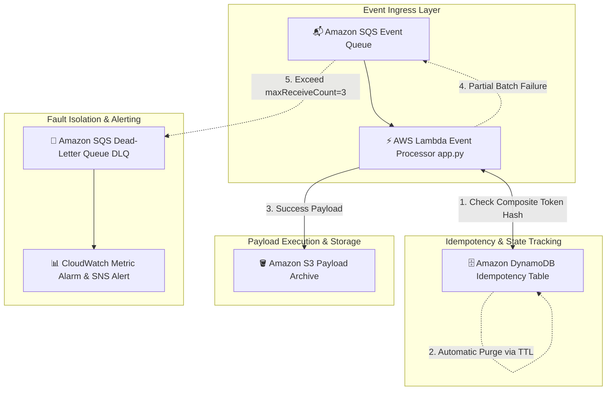

# ⚡ EventGuardian — Idempotent Serverless Event Processing Pipeline

[](https://aws.amazon.com/sqs/)
[](https://aws.amazon.com/lambda/)
[](https://aws.amazon.com/dynamodb/)
[](https://www.terraform.io/)

---

## 📌 Executive Summary & Problem Statement

### The Problem
Distributed serverless event processing pipelines encounter critical reliability risks during stream processing:
1. **Duplicate Executions:** Distributed message brokers (such as Amazon SQS) guarantee *at-least-once* delivery. Network retries frequently trigger duplicate message deliveries, leading to duplicate database writes or duplicate external API calls.
2. **Queue Clogging from Poison Payloads:** A single malformed message ("poison payload") that continuously throws uncaught exceptions can cause an entire SQS batch to fail, repeatedly retrying and blocking healthy messages behind it.
3. **Storage Overhead:** Storing message execution state indefinitely for duplicate detection creates exploding database storage costs.

### The EventGuardian Solution
EventGuardian is a **production-grade serverless event processing pipeline** built on AWS to guarantee fault tolerance and idempotent stream execution:
- **Strict Idempotency Layer:** Uses **AWS Lambda Powertools** idempotency decorators to compute composite token hashes (`[tenant_id, client_request_id]`) and track execution state in **Amazon DynamoDB** with conditional writes.
- **Automated State Cleanup:** Sets a 1-hour Time-to-Live (TTL) on idempotency records, allowing DynamoDB to automatically purge expired records without compute overhead.
- **Partial Batch Item Response Handling:** Implements `process_partial_response()` so healthy messages commit successfully while failing records return to SQS without blocking the queue.
- **Dead-Letter Queue (DLQ) Escalation:** Routes poison messages to an SQS DLQ after 3 failed retries (`maxReceiveCount = 3`) and triggers **CloudWatch metric alarms**.

---

## 📐 System Architecture



---

## 🔍 Step-by-Step Technical Workflow

1. **Batch Message Consumption:** AWS Lambda polls messages from the main **Amazon SQS** queue in configurable batch sizes.
2. **JMESPath Key Extraction:** For each message, Lambda Powertools extracts composite idempotency keys based on `[tenant_id, client_request_id]`.
3. **State Table Lookup & Lock:** Lambda executes a conditional `PutItem` operation against **Amazon DynamoDB**:
   - If the status is `IN_PROGRESS` or `COMPLETED` within the TTL window, Lambda short-circuits execution and returns the cached result.
   - If the key does not exist, a new record is created with status `IN_PROGRESS`.
4. **Partial Batch Processing:** Healthy messages are processed and written to **Amazon S3** object storage. If a specific message fails, `process_partial_response()` reports only the failing `messageId` back to SQS, committing successful messages.
5. **DLQ Redrive Escalation:** If a poison payload fails 3 consecutive delivery attempts (`maxReceiveCount = 3`), SQS automatically moves it to the **SQS Dead-Letter Queue (DLQ)**.
6. **Observability Alerting:** A **CloudWatch Metric Alarm** monitors `ApproximateNumberOfMessagesVisible` on the DLQ and triggers an **SNS topic alert** when poison messages arrive.

---

## 📂 Repository Directory Structure

```text
eventguardian/
├── lambda_processor/
│   ├── app.py                      # Main Lambda Handler with Powertools & Idempotency
│   └── requirements.txt            # Python Dependencies (aws-lambda-powertools, boto3)
├── terraform/
│   ├── main.tf                     # Provider & Terraform Configurations
│   ├── sqs.tf                      # SQS Main Queue & Dead-Letter Queue (DLQ) Configuration
│   ├── lambda.tf                   # Lambda Function, Event Source Mapping & Environment Variables
│   ├── dynamodb.tf                 # DynamoDB Idempotency Table Definition & TTL Settings
│   ├── s3.tf                       # Amazon S3 Event Archive Bucket Definition
│   ├── cloudwatch.tf               # CloudWatch Metric Alarms & Log Groups
│   ├── sns.tf                      # SNS Alert Notification Topic Definitions
│   ├── budget.tf                   # AWS Budget Alarms for Cost Safety
│   ├── iam.tf                      # IAM Execution Roles & Least-Privilege Policies
│   ├── outputs.tf                  # Infrastructure Outputs & Resource ARNs
│   └── variables.tf                # Environment Variable Inputs
├── tests/
│   ├── run_test.py                 # Fault Simulation Test Suite Runner
│   └── events.json                 # Test Payloads (Valid, Duplicate, Malformed, Poison)
└── README.md                       # Comprehensive Project Documentation
```

---

## 🛠️ Technology Stack Breakdown

- **Cloud Infrastructure:** Amazon SQS, Amazon SQS DLQ, AWS Lambda, Amazon DynamoDB (TTL Enabled), Amazon S3, Amazon CloudWatch, AWS SNS, AWS Budgets
- **Libraries & Tooling:** Python 3.13, AWS Lambda Powertools, Boto3 SDK, JMESPath
- **Infrastructure as Code:** Terraform 1.14+

---

## 🚀 How to Run & Deploy Locally

### Prerequisites
- AWS CLI configured
- Terraform 1.14+ installed
- Python 3.13+ installed

### 1. Provision Infrastructure via Terraform
```bash
cd terraform
terraform init
terraform plan
terraform apply -auto-approve
```

### 2. Execute the Fault Simulation Test Suite
Run the test suite to simulate valid, duplicate, malformed, and poison message executions:
```bash
python tests/run_test.py
```

---

## 📄 License
Distributed under the MIT License. See `LICENSE` for details.
