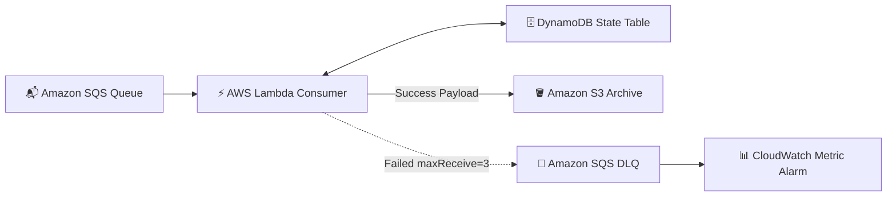

# ⚡ EventGuardian — Idempotent Serverless Event Pipeline

[](https://aws.amazon.com/sqs/)
[](https://aws.amazon.com/lambda/)
[](https://aws.amazon.com/dynamodb/)
[](https://www.terraform.io/)

A resilient serverless batch stream processing pipeline on AWS with strict **message idempotency**, partial batch response handling, and automated **Dead-Letter Queue (DLQ)** escalation.

---

## 🎯 Architectural Overview

EventGuardian consumes event streams from Amazon SQS without duplicate side-effects or queue clogging. Using `aws-lambda-powertools`, it extracts composite keys (`[tenant_id, client_request_id]`) to maintain idempotency records in **Amazon DynamoDB** with a 1-hour TTL. Successful messages archive to **Amazon S3**, while failing payloads escalate to an SQS Dead-Letter Queue with CloudWatch alarms.



---

## ⚡ Key Engineering Features

- **🛡️ DynamoDB Idempotency Layer:** Uses `aws-lambda-powertools` idempotency decorators to store token hashes in DynamoDB with a 1-hour TTL, short-circuiting duplicate requests.
- **⚡ Partial Batch Item Handling:** Employs `process_partial_response()` so healthy messages commit while failing ones retry without blocking the batch.
- **🚨 Automated DLQ Escalation:** Configures SQS redrive policy (`maxReceiveCount = 3`) to isolate poison payloads into an SQS DLQ with CloudWatch metric alarms.
- **🏗️ 100% Terraform Provisioning:** Declaratively provisions SQS queues, Lambda functions, DynamoDB state tables, S3 buckets, and CloudWatch alarms (`sqs.tf`, `lambda.tf`, `dynamodb.tf`, `s3.tf`).
- **🧪 Fault Simulation Suite:** Includes mock events (`events.json`) testing valid, duplicate, malformed, poison, and conflict payloads.

---

## 🛠️ Technology Stack

- **Cloud Services:** Amazon SQS & SQS DLQ, AWS Lambda, Amazon DynamoDB, Amazon S3, CloudWatch Metrics, SNS Alarms
- **Languages & Tools:** Python 3.13, AWS Lambda Powertools, Boto3, JMESPath
- **Infrastructure as Code:** Terraform 1.14+

---

## 🚀 Quickstart & Usage

### 1. Provision Serverless Infrastructure
```bash
cd terraform
terraform init
terraform apply
```

### 2. Run Fault Simulation Suite
```bash
python lambda_processor/app.py
```

---

## 📄 License
Distributed under the MIT License.
