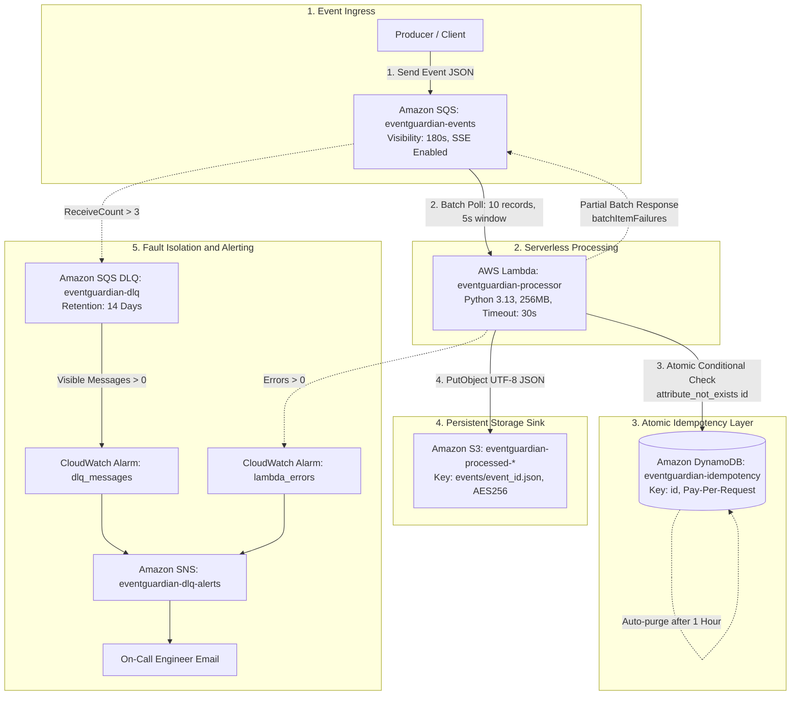

# EventGuardian

An idempotent, fault-tolerant serverless event processing pipeline on AWS using SQS Standard, Lambda, DynamoDB, and S3.

[](https://aws.amazon.com/)
[](https://www.terraform.io/)
[](https://www.python.org/)
[](LICENSE)
[](tests/)

---

## Overview

In distributed cloud architectures, asynchronous stream processing systems rely on message brokers like Amazon SQS Standard to handle bursty event traffic. However, SQS Standard operates under **at-least-once delivery** semantics. This introduces three critical operational challenges:

1. **Duplicate Executions:** Network retries, producer duplicate sends, and visibility timeout expirations cause messages to be delivered multiple times, risking duplicate downstream mutations.
2. **Batch Head-of-Line Blocking:** In default SQS-to-Lambda integrations, if a single message in a batch fails (a poison pill), the entire batch fails and is retried, causing healthy sibling events to be repeatedly re-executed.
3. **Runaway Deduplication State Costs:** Storing deduplication keys permanently in state tables leads to compounding storage costs and degraded query performance over time.

**EventGuardian** provides a production-ready solution to these challenges:
- Decouples ingestion via **Amazon SQS Standard**.
- Enforces atomic deduplication using **AWS Lambda Powertools** and **Amazon DynamoDB** conditional writes.
- Manages deduplication storage costs using automated **DynamoDB Time-to-Live (TTL)** expiration.
- Prevents head-of-line blocking by returning partial batch failures (`ReportBatchItemFailures`).
- Persists validated events immutably to **Amazon S3**.
- Quarantines poison pills into an **SQS Dead-Letter Queue (DLQ)** with automated **CloudWatch** metric alarms and **Amazon SNS** email alerting.

---

## Architecture



---

## Key Features

* **SQS-Based Asynchronous Decoupling:** Ingests bursty incoming workloads into Amazon SQS Standard, buffering traffic and decoupling producers from consumer latency.
* **Atomic Idempotency Layer:** Uses DynamoDB conditional writes (`attribute_not_exists(id)`) and composite hashing (`[tenant_id, client_request_id]`) to prevent duplicate event execution and manage in-flight concurrency locks.
* **Payload Validation JMESPath:** Inspects `[event_type, payload]` hashes to reject requests reusing an existing client request ID with modified payload data (`IdempotencyValidationError`).
* **Automated State Expiration (TTL):** Automatically purges idempotency state records from DynamoDB after 1 hour (3,600 seconds) at zero cost to write capacity units.
* **Partial Batch Failure Isolation:** Implements SQS `ReportBatchItemFailures` via AWS Lambda Powertools. If 1 of 10 messages fails, only the failed record ID is returned to SQS; successful messages are deleted immediately.
* **S3 Durable Event Archive:** Stores validated event payloads as UTF-8 JSON objects in Amazon S3 (`events/{event_id}.json`) with AES-256 server-side encryption and automated noncurrent version lifecycle management.
* **Dead-Letter Queue (DLQ) & Redrive:** Quarantines messages exceeding 3 receive attempts (`maxReceiveCount = 3`) into a dedicated DLQ with a 14-day retention window.
* **Automated Metric Alarms & Notifications:** CloudWatch alarms monitor DLQ depth and Lambda execution errors with `treat_missing_data = "notBreaching"`, notifying engineers via Amazon SNS.
* **Concurrency Guardrails:** Configured with `maximum_concurrency = 50` on the SQS event source mapping to prevent sudden event surges from exhausting account-level concurrency or throttling downstream storage.
* **Infrastructure as Code (Terraform):** Declarative, modular Terraform configuration managing all cloud resources with least-privilege IAM policies and budget cost controls.
* **Fast Offline Test Suite:** Automated testing suite using `pytest` and `moto` validating 8 critical scenarios locally without deploying real AWS resources.

---

## Architecture Flow

1. **Event Ingestion:** An upstream producer sends an event payload to the primary SQS queue (`eventguardian-events`).
2. **Batch Polling:** Lambda Event Source Mapping polls SQS, gathering up to 10 messages (or waiting up to 5 seconds to maximize batch density).
3. **Lambda Context & Lock Acquisition:**
   - The Lambda handler registers execution context to calculate remaining execution time.
   - For each message, Powertools extracts a composite key based on `[tenant_id, client_request_id]`.
   - An atomic conditional `PutItem` is issued to DynamoDB.
   - **If first arrival:** Status is saved as `IN_PROGRESS`.
   - **If duplicate completed:** The cached completion payload is returned without re-executing S3 writes.
   - **If concurrent in-progress:** `IdempotencyAlreadyInProgressError` is raised, queuing the message for retry.
4. **Validation & S3 Persistence:** The event schema is validated. Valid events are serialized to UTF-8 JSON and uploaded to Amazon S3 at `events/{event_id}.json`.
5. **State Finalization:** DynamoDB is updated to `status = COMPLETED` with an expiration timestamp set to $T_{\text{now}} + 3600\text{s}$.
6. **Partial Batch Acknowledgment:**
   - Completed messages are deleted from SQS.
   - Failed messages are returned in `batchItemFailures` and remain in SQS for redelivery after the visibility timeout ($180\text{s}$).
7. **Dead-Letter Routing & Alerting:** If a poison pill exhausts 3 delivery attempts, SQS moves it to `eventguardian-dlq`. CloudWatch triggers an alarm on `ApproximateNumberOfMessagesVisible > 0` and dispatches an SNS email alert.

---

## AWS Services

| Service | Role in EventGuardian | Configuration Details |
| :--- | :--- | :--- |
| **Amazon SQS** | Ingestion message buffer | Standard queue, `visibility_timeout_seconds = 180`, SSE-SQS encryption. |
| **AWS Lambda** | Event processing engine | Python 3.13 runtime, 256MB memory, 30s timeout, ESM batch size 10, batch window 5s, max concurrency 50. |
| **Amazon DynamoDB** | Idempotency lock & state store | `PAY_PER_REQUEST` on-demand billing, partition key `id` (String), native TTL on `expiration`. |
| **Amazon S3** | Durable event archive | Versioning enabled, default AES-256 SSE, 4 public access blocks, 90-day expiration, 14-day noncurrent version expiration. |
| **Amazon SQS (DLQ)** | Poison pill quarantine | Dead-letter target with `maxReceiveCount = 3`, 14-day retention (`1209600`s), SSE-SQS encryption. |
| **Amazon CloudWatch** | Observability & alerting | 7-day log retention, alarms for DLQ visible messages (`> 0`) and Lambda errors (`> 0`), `treat_missing_data = "notBreaching"`. |
| **Amazon SNS** | Operational alerting | Topic `eventguardian-dlq-alerts` with email subscription for on-call notification. |
| **AWS IAM** | Security boundary | Dedicated execution role with scoped least-privilege permissions and zero wildcard resources. |
| **AWS Budgets** | Cost guardrail | Monthly $5.00 budget with email notification triggered at 80% ($4.00) actual spend. |

---

## Repository Structure

```
eventguardian/
├── lambda_processor/
│   ├── app.py                      # Lambda handler, batch processor, and idempotency logic
│   └── requirements.txt            # Runtime dependencies (aws-lambda-powertools, boto3)
├── terraform/
│   ├── main.tf                     # Terraform provider and backend definitions
│   ├── variables.tf                # Input variable declarations (budget_alert_email)
│   ├── terraform.tfvars            # Local variable assignments
│   ├── outputs.tf                  # Infrastructure output definitions (queue URLs, bucket)
│   ├── sqs.tf                      # Primary SQS queue and Dead-Letter Queue (DLQ)
│   ├── lambda.tf                   # Lambda function, Event Source Mapping, and Log Group
│   ├── dynamodb.tf                 # DynamoDB idempotency table with TTL attribute
│   ├── s3.tf                       # S3 processed events bucket and lifecycle policies
│   ├── iam.tf                      # Lambda IAM execution role and least-privilege policy
│   ├── cloudwatch.tf               # CloudWatch metric alarms for DLQ and Lambda errors
│   ├── sns.tf                      # SNS alerting topic and email subscription
│   └── budget.tf                   # AWS Budget cost guardrail
├── tests/
│   ├── test_pipeline.py            # Automated offline integration test suite (Moto + Pytest)
│   ├── run_test.py                 # Live CLI integration script for sending SQS messages
│   ├── events.json                 # Sample multi-event batch dataset (including poison event)
│   ├── valid/                      # Valid event test payload
│   ├── duplicate/                  # Duplicate event payloads for idempotency verification
│   ├── conflict/                   # Key collision test payloads with mutated contents
│   ├── malformed/                  # Schema violation and malformed JSON test payloads
│   └── poison/                     # Controlled poison pill test payload
├── build_lambda.py                 # Cross-platform packaging script (creates lambda_function.zip)
├── pytest.ini                      # Pytest discovery configuration
├── LICENSE                         # MIT License
└── README.md                       # Project documentation
```

---

## Prerequisites

* **Python 3.12+** (tested on Python 3.13 / 3.14)
* **Terraform v1.5+** (tested on Terraform v1.14+)
* **AWS CLI v2** configured with appropriate deployment credentials (`aws configure`)
* **pip** package manager

---

## Setup & Deployment

### 1. Clone Repository & Setup Virtual Environment

```bash
git clone https://github.com/sanmathik8/eventguardian.git
cd eventguardian

# Create and activate Python virtual environment
python -m venv .venv

# On Linux/macOS:
source .venv/bin/activate

# On Windows (PowerShell):
.venv\Scripts\Activate.ps1
```

### 2. Install Development & Testing Dependencies

```bash
pip install -r lambda_processor/requirements.txt
pip install pytest "moto[dynamodb,s3,sqs]"
```

### 3. Build the Lambda Package

EventGuardian includes a cross-platform Python build script that cleans previous artifacts, vendors production dependencies, copies handler code, and packages `lambda_function.zip`:

```bash
python build_lambda.py
```

Expected output:
```text
[EventGuardian] Starting packaging...
[EventGuardian] Installing dependencies...
[EventGuardian] Creating archive: lambda_function.zip...
[EventGuardian] SUCCESS! Lambda package created (~19 MB)
```

### 4. Configure Terraform Variables

Create or edit `terraform/terraform.tfvars` with your alerting email address:

```hcl
budget_alert_email = "your-email@example.com"
```

### 5. Initialize & Deploy Infrastructure

```bash
# Initialize Terraform and download AWS provider plugins
terraform -chdir=terraform init

# Review execution plan
terraform -chdir=terraform plan

# Apply configuration to AWS
terraform -chdir=terraform apply -auto-approve
```

Confirm the subscription link sent to your email by AWS SNS to activate alert notifications.

---

## Configuration

| Variable / Setting | Location | Default / Configured | Description |
| :--- | :--- | :--- | :--- |
| `budget_alert_email` | `terraform/terraform.tfvars` | *User Defined* | Email endpoint for AWS Budgets and DLQ CloudWatch alarm notifications. |
| `IDEMPOTENCY_TABLE` | `terraform/lambda.tf` (Env Var) | `eventguardian-idempotency` | DynamoDB table name for idempotency tracking. |
| `OUTPUT_BUCKET` | `terraform/lambda.tf` (Env Var) | `eventguardian-processed-*` | S3 bucket destination for archived events. |
| `batch_size` | `terraform/lambda.tf` | `10` | Maximum number of SQS records delivered per Lambda invocation. |
| `maximum_batching_window_in_seconds` | `terraform/lambda.tf` | `5` | Maximum wait time to gather up to 10 records before invoking Lambda. |
| `maximum_concurrency` | `terraform/lambda.tf` | `50` | Maximum concurrent Lambda instances spawned by the SQS event source mapping. |
| `visibility_timeout_seconds` | `terraform/sqs.tf` | `180` | Time SQS hides in-flight messages ($6\times$ Lambda timeout of 30s). |
| `maxReceiveCount` | `terraform/sqs.tf` | `3` | Number of failed attempts before a message is moved to the DLQ. |
| `expires_after_seconds` | `lambda_processor/app.py` | `3600` | Idempotency record expiration time (1 hour). |

---

## Testing

EventGuardian includes an automated offline test suite powered by `pytest` and `moto`. It runs entirely in-memory with zero AWS API calls and zero cloud costs.

### Running the Offline Test Suite

```bash
pytest -v
```

### Test Scenarios Covered

| Test Function | Target Scenario | Validation Criteria |
| :--- | :--- | :--- |
| `test_1_successful_event_processing` | Happy path execution | Valid event processes successfully; UTF-8 JSON object written to S3. |
| `test_2_duplicate_event_idempotency` | Duplicate message arrival | Second identical call returns cached result; no redundant S3 write. |
| `test_3_concurrent_duplicate_in_progress` | Concurrent race condition | Simultaneous request raises `IdempotencyAlreadyInProgressError`. |
| `test_4_partial_batch_failures` | Batch with processing failure (5 events, 1 failure) | Only failing message ID returned in `batchItemFailures`; 4 valid events saved to S3. |
| `test_5_processing_failure_error` | Downstream failure propagation | Unhandled runtime error (simulated S3 service failure) raises and propagates correctly. |
| `test_6_missing_required_fields` | Technical contract validation | Missing or empty required fields (`tenant_id`, `client_request_id`, `event_id`) trigger `ValueError`. |
| `test_7_payload_mutation_conflict` | Reused request ID with altered payload | Raises `IdempotencyValidationError`, preventing payload tampering. |
| `test_8_invalid_json_body_partial_batch_failure` | Malformed JSON in SQS body | Unparseable JSON record is isolated in `batchItemFailures` without crashing batch. |

### Running Live Tests against AWS (Optional)

After applying Terraform, retrieve the queue URL and use `tests/run_test.py`:

```bash
# On Linux/macOS:
export EVENTGUARDIAN_QUEUE_URL=$(terraform -chdir=terraform output -raw event_queue_url)
python tests/run_test.py tests/valid/valid.json

# On Windows (PowerShell):
$env:EVENTGUARDIAN_QUEUE_URL = (terraform -chdir=terraform output -raw event_queue_url)
python tests/run_test.py tests/valid/valid.json
```

---

## Failure Handling

EventGuardian implements multi-tier fault tolerance across the entire processing lifecycle:

```
[Event Arrives]
       │
       ├── Duplicate? ──────────> Return Cached Response (Skip Processing)
       │
       ├── Schema Invalid? ─────> Raise Error ──> SQS Partial Failure Report
       │
       ├── Poison Pill? ────────> Raise Error ──> SQS Partial Failure Report
       │                                                 │
       │                                         (Retry 1, 2, 3)
       │                                                 │
       │                                                 v
       │                                     Route to DLQ (14-day retention)
       │                                                 │
       │                                                 v
       │                                     CloudWatch Alarm Triggers
       │                                                 │
       │                                                 v
       │                                     SNS Notification to On-Call
       │
       └── Valid? ──────────────> Write S3 ───> Update DynamoDB COMPLETED ──> Delete SQS Message
```

* **Partial Batch Failures:** With `function_response_types = ["ReportBatchItemFailures"]`, only failed message IDs are returned in `batchItemFailures`. SQS automatically acknowledges and deletes successful messages while scheduling only the failed messages for redelivery.
* **Poison Pill Quarantine:** If an unprocessable event fails 3 times (`maxReceiveCount = 3`), SQS routes it to `eventguardian-dlq`. This unblocks the queue and prevents infinite retry loops.
* **Idempotency Locking:** DynamoDB conditional writes guarantee that simultaneous invocations for the same `[tenant_id, client_request_id]` do not execute concurrent side effects.
* **Crash Recovery:** If Lambda crashes while processing, the lock expires after its configured timeout, allowing subsequent SQS redelivery to safely resume.

---

## Security

* **IAM Principle of Least Privilege:**
  * Lambda role permissions are strictly scoped to exact resource ARNs ([`terraform/iam.tf`](terraform/iam.tf)).
  * S3 access is restricted solely to `s3:PutObject` under `events/*`.
  * SQS access is restricted to receive, delete, and change visibility on the primary queue ARN.
  * No wildcard `Resource: "*"` statements exist.
* **S3 Security Controls:**
  * Public access is completely blocked (`block_public_acls`, `block_public_policy`, `ignore_public_acls`, `restrict_public_buckets`).
  * Default server-side encryption with AES-256 (`apply_server_side_encryption_by_default`).
  * S3 bucket versioning is enabled.
* **Queue Encryption:**
  * SQS queues use native server-side encryption (`sqs_managed_sse_enabled = true`).
* **Secret Management:**
  * Alert emails are marked `sensitive = true` in Terraform variable definitions to prevent accidental logging in CI/CD console outputs.

---

## Cost Considerations

EventGuardian is designed to operate with near-zero baseline costs on AWS:

* **DynamoDB On-Demand:** `PAY_PER_REQUEST` billing mode ensures zero idle cost. You pay only for actual read and write operations.
* **Zero-Cost State Expiration:** DynamoDB native TTL deletes expired idempotency items in the background without consuming Write Capacity Units (WCUs).
* **SSE-SQS Encryption:** Uses native SQS-managed encryption instead of AWS KMS customer-managed keys, eliminating KMS API call fees ($0.03 per 10,000 requests).
* **Batch Density Optimization:** `maximum_batching_window_in_seconds = 5` allows Lambda to assemble denser batches during low-traffic periods, reducing total Lambda invocations by up to $5\times - 10\times$.
* **S3 Lifecycle Management:**
  * Current objects expire after 90 days.
  * Overwritten noncurrent versions expire after 14 days (`noncurrent_version_expiration`).
  * Incomplete multipart uploads are aborted after 7 days.
* **CloudWatch Log Retention:** Lambda log retention is capped at 7 days to eliminate indefinite log storage charges.
* **AWS Budget Guardrail:** A $5.00 monthly budget alerts via email when forecast or actual spending exceeds 80% ($4.00).

---

## Cleanup

To destroy all provisioned AWS resources and avoid ongoing charges:

```bash
# Optional: Empty the S3 bucket if objects were written during live testing:
# aws s3 rm s3://<processed-bucket-name> --recursive

# Destroy all Terraform infrastructure
terraform -chdir=terraform destroy -auto-approve
```

---

## Limitations / Design Considerations

* **SQS Standard Ordering:** SQS Standard delivers messages with best-effort ordering. Workloads requiring strict chronological per-key ordering should consider SQS FIFO (with the understanding that FIFO limits throughput to 300 msgs/s without batching, or 3,000 msgs/s with batching, and introduces head-of-line blocking).
* **Idempotency Window Boundary:** DynamoDB idempotency TTL is set to 1 hour (3,600 seconds). A duplicate message arriving after 3,600 seconds will be treated as a new event.
* **Dual-Write Architecture:** The Lambda function writes to S3 and then updates DynamoDB to `COMPLETED`. Because atomic two-phase commits do not exist across independent cloud services, this pipeline guarantees **at-least-once storage with deterministic idempotency**: S3 `PutObject` operations are deterministic and overwrite identical keys safely during redeliveries.
* **Account Concurrency Limit:** SQS ESM concurrency is capped at 50 instances (`maximum_concurrency = 50`) to protect downstream DynamoDB write limits and preserve regional account concurrency.

---

## License

This project is licensed under the [MIT License](LICENSE).
